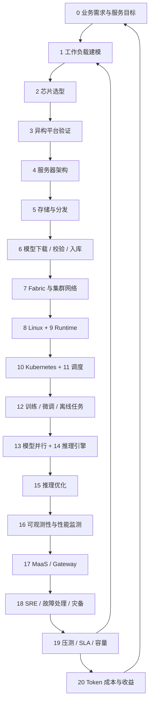

# AI Infra 工程师知识库：从 GPU 服务器采购到 Token 交付

> 版本：1.2 · 编写与资料核对日期：2026-09-07
>
> 适用对象：具备 Linux、网络和编程基础，准备承担 AI 基础设施工作的工程师。
>
> 主线：企业自建或租用 GPU 集群上的在线大模型推理；兼顾离线推理、训练、微调及异构加速器。
>
> 阅读约定：以 NVIDIA 生态解释主要操作路径，补充昇腾与 AMD 的差异；具体型号、驱动、框架及功能兼容性，以公司验证过的版本矩阵为准。

这份知识库的目标，是让新人能够把业务需求转成可验收的算力方案，把服务器转成稳定的模型服务，并持续改善合格 Token 的成本与交付能力。它既是学习材料，也是实操、评审和知识积累的统一入口。

文中的计算案例、SLO 数值、训练计划和验收模板均为教学设计，不代表公司现状、厂商实测或采购承诺。理论公式用于缩小方案范围，采购与生产容量必须以目标模型、真实流量分布和故障场景下的测试为依据。

## 目录

- [一、知识地图与使用方法](#map)
- [二、全链路核心知识（0–20）](#core)
- [0. 业务需求、SLI、SLO、SLA 与成本边界](#layer-0)
- [1. 模型工作负载分析与容量估算](#layer-1)
- [2. GPU / NPU 芯片选型](#layer-2)
- [3. 异构平台与迁移验证](#layer-3)
- [4. GPU 服务器架构](#layer-4)
- [5. 存储与模型分发](#layer-5)
- [6. 模型下载、完整性校验与入库](#layer-6)
- [7. GPU Fabric、集群网络与集合通信](#layer-7)
- [8. Linux、NUMA 与 PCIe 系统调优](#layer-8)
- [9. GPU Runtime 与容器运行栈](#layer-9)
- [10. Kubernetes GPU 平台](#layer-10)
- [11. GPU 调度与批任务调度](#layer-11)
- [12. 训练、微调与离线任务基础](#layer-12)
- [13. 模型架构与分布式并行](#layer-13)
- [14. 推理引擎](#layer-14)
- [15. 推理优化](#layer-15)
- [16. 可观测性与性能监测](#layer-16)
- [17. MaaS、Gateway 与多租户服务](#layer-17)
- [18. SRE、故障处理与灾备](#layer-18)
- [19. Benchmark、SLA 验证与容量规划](#layer-19)
- [20. Token 经济模型](#layer-20)
- [三、贯穿案例：从需求到采购数量和 Token 成本](#case)
- [四、12 周新人培养与实操考核](#training)
- [五、可复用工程模板](#templates)
- [六、术语、常见误区与官方资料](#references)

<a id="map"></a>
## 一、知识地图与使用方法

### 1.1 从业务反推建设，从底层验证到服务

本知识库将异构验证、训练、可观测性和 SRE 融入主线，并补齐模型下载环节，共包含 21 个模块，编号为 0–20。实际工作不是一次性顺序走完：业务定义验收目标，硬件与软件共同决定容量，压测和成本结果又会反过来改变选型。



若阅读器不支持 Mermaid，可按“需求 → 工作负载 → 芯片与异构验证 → 服务器架构 → 存储 → 模型下载与校验 → 网络与系统 → 平台调度 → 训练/微调 → 模型并行与推理优化 → 可观测性 → MaaS → SRE → 压测 → 经济模型”的顺序阅读。

图中同时表达学习衔接与工程依赖。项目可按业务选择训练自有模型或直接使用已发布模型；可观测性和 SRE 贯穿实施与运行。

### 1.2 新增知识为何必要

| 补充主题 | 只掌握原技术栈仍无法解决的问题 | 关键交付物 |
| --- | --- | --- |
| 模型下载与入库 | 找到了模型名称，却无法复现权重版本或保证文件完整 | 固定 Revision、文件清单、校验摘要、入库记录 |
| 可观测性 | 请求变慢，却不能定位是哪一层消耗了时间 | 指标字典、链路追踪、性能基线 |
| SRE 与灾备 | 压测通过，但节点故障、升级和流量突增时不可用 | Runbook、演练记录、恢复目标 |
| 训练与异构 | 只有推理单一路径，无法理解资源竞争和迁移成本 | 作业基线、兼容性与质量评测 |

### 1.3 四级能力与学习原则

| 等级 | 能力定义 | 应提供的证据 |
| --- | --- | --- |
| L1 理解 | 能解释原理、指标、边界与常见失败方式 | 概念复述、图解、计算题 |
| L2 执行 | 按已验证步骤独立完成部署或测试 | 环境记录、命令、原始结果 |
| L3 排障 | 能提出假设、隔离变量并恢复服务 | 时间线、对照实验、根因与回归结果 |
| L4 设计 | 能在性能、可靠性、成本和维护复杂度之间取舍 | 设计评审、容量模型、成本模型、验收证据 |

新人先以 L2 为阶段目标，再通过故障演练进入 L3。无需一开始就熟练实现 CUDA Kernel 或设计大型 Fabric；但必须知道问题属于哪一层、向谁求助、需要采集什么证据。

所有实操遵循“记录环境 → 建立基线 → 一次改变一个主要变量 → 验证功能与性能 → 保存结论”。软件支持情况、默认参数和指标名属于版本事实；公式、排障思路和评审方法属于可复用知识。

<a id="core"></a>
## 二、全链路核心知识（0–20）

<a id="layer-0"></a>
## 0. 业务需求、SLI、SLO、SLA 与成本边界

### 0.1 必须掌握

- **服务形态**：交互式对话、代码补全、长文档总结、Agent、多模态、Embedding、Rerank、离线批处理。它们的瓶颈和收费单位可能不同。
- **SLI**：实际测量的指标，如成功率、端到端 TTFT、请求延迟和流式中断率。
- **SLO**：内部服务目标，必须包含适用请求、阈值、统计方法和时间窗口。
- **SLA**：对客户或内部使用方作出的服务约定，还可能包含责任边界、排除项及补偿规则。
- **质量目标**：任务正确率、结构化输出有效率、工具调用成功率、长上下文能力等。性能优化不能脱离质量验收。
- **资源边界**：自建、托管、租赁或云实例；是否允许跨地域、混部、抢占和外部模型兜底。

SLO 应从用户体验出发。仅报告“服务可连通”不能代表模型可用；HTTP 200 后流式输出中断也可能是失败。错误预算可以按合格请求占比计算，避免把所有故障机械换成停机分钟。方法参考 [Google SRE：实施 SLO](https://sre.google/workbook/implementing-slos/)。

### 0.2 需求采集表

| 维度 | 要问清楚的内容 | 对架构的影响 |
| --- | --- | --- |
| 流量 | 平均与峰值 RPS、到达间隔、突发持续时间、增长预测 | 副本、队列、弹性与容量余量 |
| 长度 | 输入/输出 Token 的联合分布、上限、长尾比例 | KV、Prefill/Decode 配比、请求分池 |
| 交互 | 是否流式、用户取消、会话轮数、Agent 步数 | 连接管理、缓存复用、取消传播 |
| 服务目标 | TTFT、TPOT/ITL、端到端时延、成功率 | 调度策略与合格容量 |
| 模型 | 模型版本、质量阈值、量化容忍度 | 显存、Kernel、引擎和硬件 |
| 连续性 | 可接受故障域、维护窗口、RTO、RPO | 跨节点部署、冗余、备份 |
| 商业 | 预算、计费单位、成本归集、租户优先级 | 选型、配额、收费和核算 |

**教学 SLO 示例**：对输入不超过 4,096 Token、输出不超过 1,024 Token 的某版本对话模型，在指定区域与客户端测量点，按 30 天统计成功率；按固定时间窗口统计成功请求的 p95 TTFT 和 p95 TPOT。同时独立记录拒绝、超时、断流与取消。具体阈值由业务与实测确定，不能复用别的模型的数字。

### 0.3 实践、交付与验收

选择一个真实业务，完成一页《服务需求与 SLO 合同》。交付流量样本、请求分桶、质量要求、预算与责任边界。验收时必须能解释“谁的请求被统计、在哪里测量、哪些失败进入分母、超目标后怎样处理”。

<a id="layer-1"></a>
## 1. 模型工作负载分析与容量估算

### 1.1 模型结构与请求画像

模型侧记录：总参数量、每 Token 激活参数量、层数、Hidden Size、Attention Heads、KV Heads、Head Dimension、词表、精度、最大上下文、Attention 类型、MoE 专家数与 Top-K、多模态编码器、权重格式和 Tokenizer。

请求侧记录：输入/输出长度的**联合分布**、会话复用、系统提示前缀、采样参数、思考长度、工具调用循环、取消与重试。不要把“平均输入长度”和“平均输出长度”拼成一个不存在的典型请求；长输入可能恰好伴随长输出。

**Prefill** 一次处理一段输入，建立上下文状态；**Decode** 利用已有状态逐步生成。常见稠密 Transformer 中，长输入、大 Batch 的 Prefill 往往更偏计算瓶颈，小 Batch Decode 往往更偏权重/KV 访存与调度开销。它们不是固定的硬件属性，Batch、上下文、MoE、量化和并行度都可能改变瓶颈。

### 1.2 权重显存

```text
权重字节数下界 ≈ 总参数量 P × 每参数位数 b / 8
运行显存 = 本 rank 常驻权重 + KV / 模型状态 + 激活与工作区
         + 通信缓冲 + 图捕获/编译相关分配 + 碎片及安全余量
```

BF16/FP16 通常按 2 字节/参数粗估；INT8 按 1 字节；4 bit 按 0.5 字节。量化还包含 Scale、Zero Point、分组元数据和未量化层；加载阶段可能有额外副本。磁盘权重大小不能直接视作运行显存。

MoE 的激活参数量主要帮助理解计算量，**容量规划仍必须覆盖常驻的总权重**。不能按“每次只激活一部分专家”把所有未激活专家从显存账单中删掉；如果确实采用 Offload，则要额外计入搬运延迟和带宽。

### 1.3 KV Cache 估算

对于常规自回归 Transformer 的 MHA/GQA/MQA，假设每层缓存完整 K、V，且各层结构相同：

```text
每个已缓存 Token 的 KV 字节数
  = 2 × 层数 L × KV Heads 数 Hkv × Head Dimension Dh × KV 元素字节数 s

总 KV 字节数
  ≈ 每 Token KV 字节数 × 所有驻留序列当前缓存长度之和
```

其中 `2` 表示 K 和 V。容量上限估算需考虑输入加已生成输出，而不只看输入。Beam Search、多候选生成、共享前缀、分页块取整和缓存淘汰策略会改变实际占用。

**教学计算**：32 层、8 个 KV Heads、Head Dimension 128、BF16 KV：每 Token 为 `2 × 32 × 8 × 128 × 2 = 131,072 B = 128 KiB`；一条 8,192 Token 的完整缓存约 1 GiB；32 条互不共享的同长度序列约 32 GiB。

注意三个边界：

- TP 下的每卡 KV 是否按并行度均匀缩小，取决于 KV Heads 切分、复制规则和引擎实现；不能统一除以 TP。
- MLA、滑动窗口、混合 Attention、状态空间模型等要按实际状态布局估算；不能直接套上述公式。
- PagedAttention 改善分配和共享方式，不意味着单份标准 K/V 的理论字节数自动变小。原理见 [PagedAttention 论文](https://arxiv.org/abs/2309.06180)。

### 1.4 算力、带宽与排队的粗模型

```text
算术强度 AI = FLOPs / 从目标存储层搬运的字节数
Roofline 性能上限 ≈ min(有效计算上限, 有效带宽 × AI)

稠密模型线性层的前向计算量粗估 ≈ 2 × 参数量 × 处理 Token 数
稳态系统内平均请求数 Lq = 到达率 λ × 平均系统停留时间 W
```

`2P` 近似省略 Attention 的上下文相关开销、非线性操作和通信，不是完整成本公式；MoE 应区分激活计算与常驻权重。Little 定律要求系统稳定、边界一致，不能用 p99 延迟代替平均值，也不能把等待队列里的请求都算成已占用 GPU KV 的序列。

### 1.5 实践、交付与验收

为一个 Dense 和一个 MoE 模型制作《工作负载画像与显存预算》，从配置文件提取参数，估算权重/KV，再与实际启动、暖机及压力下的每卡峰值比较。验收要求解释至少三类偏差，并识别“能加载”“能接纳并发”“能满足 SLO”是三个不同条件。

<a id="layer-2"></a>
## 2. GPU / NPU 芯片选型

### 2.1 选型维度

| 维度 | 核心问题 | 必须取得的证据 |
| --- | --- | --- |
| 显存 | 权重、KV、工作区及余量是否装得下 | 目标模型的每卡峰值显存 |
| HBM 带宽 | Decode 与长上下文访存能否满足目标 | 实测吞吐/延迟与访存指标 |
| 计算能力 | 目标精度与 Shape 能否使用高效计算单元 | Kernel 支持、Profiler、模型压测 |
| 互联 | 卡间/跨节点带宽与拓扑是否匹配 TP、EP | 拓扑图、通信基线、扩展效率 |
| 软件生态 | 模型、量化、多模态及调试工具是否可用 | 已验证版本组合与限制清单 |
| 功耗散热 | 功率上限、降频、风冷/液冷条件是否满足 | 持续负载功率与温度记录 |
| 运维能力 | 监控、诊断、隔离、替换及厂商支持是否完整 | 故障演练、服务条款 |
| 生命周期 | 交期、保修、维护周期、后续扩容与替代 | 正式报价与供应保障材料 |

峰值 TFLOPS 必须说明精度、Dense/Sparse、计算条件和单位。FP8/INT8 的理论值不能直接与 BF16 实测吞吐比较；芯片支持某精度，也不代表目标模型在选定引擎中已有相应 Kernel。

### 2.2 决策方法

先设置硬门槛：模型正确性、显存、服务目标、可部署性、供电散热、采购可得性。未通过硬门槛的候选不进入加权评分。再比较满足同一请求分布和 SLO 时的成本、能效、扩展性及维护投入。

PoC 同时保留“同等软件条件的可比测试”和“各平台合理调优后的最佳可交付结果”。前者方便定位差异，后者更接近采购决策；两者必须标明，不能混成一张排行榜。

### 2.3 实践、交付与验收

产出至少两个候选的选型表，给出淘汰条件、通过条件、测试结果、软件风险和迁移工作量。结论应写成“在某模型、流量和 SLO 下，方案 A 的每百万合格 Token 成本较低”，而不是“某卡一定最好”。正式 SKU、价格与交期每次采购重新核实。

<a id="layer-3"></a>
## 3. 异构平台与迁移验证

### 3.1 按职责理解生态映射

| 职责 | NVIDIA 常见组件 | AMD 常见组件 | 昇腾常见组件 |
| --- | --- | --- | --- |
| 计算软件栈 | CUDA | ROCm / HIP | CANN |
| 集合通信 | NCCL | RCCL | HCCL |
| 框架适配 | PyTorch CUDA 构建等 | PyTorch ROCm 构建等 | Ascend Extension for PyTorch 等 |
| 设备观测 | nvidia-smi、DCGM | AMD SMI 及 ROCm 工具 | npu-smi 及对应诊断工具 |
| 推理路径 | vLLM、SGLang、TRT-LLM 等 | 受支持的 ROCm 引擎/后端 | MindIE 或受支持的适配引擎 |
| 平台集成 | Device Plugin / Operator / DRA 驱动 | 对应设备插件与 Operator | 对应设备插件与集群组件 |

表格表示职责相近，不代表接口、能力或版本一一兼容。CUDA、ROCm、CANN 的覆盖范围并非完全相同；不要仅通过替换库名或环境变量推断迁移已经完成。AMD 组件职责参见 [RCCL 文档](https://rocm.docs.amd.com/projects/rccl/en/latest/) 与 [AMD SMI 文档](https://rocm.docs.amd.com/projects/amdsmi)。

### 3.2 迁移验证顺序

1. 确定模型版本、权重格式、业务接口、质量指标及目标精度。
2. 核对硬件/OS/驱动/框架/引擎完整兼容矩阵，确认 Dense、MoE、长上下文、多模态与量化支持。
3. 做单算子和单卡模型验证，检查不支持算子、CPU Fallback、隐式数据搬运和数值差异。
4. 验证多卡通信、并行映射、KV 布局、容器与调度。
5. 在同一业务流量下测质量、延迟、吞吐、功率、冷启动及故障恢复。
6. 评估工程投入：自定义 Kernel、模型转换、镜像、监控、Runbook、维护与升级成本。
7. 形成“支持 / 有条件支持 / 未验证 / 不支持”的矩阵，每格附版本和证据。

昇腾软件需核对 CANN、HCCL、框架扩展及 MindIE 的配套版本；通信调试参数也不是 NCCL 参数的直接翻译。官方入口见 [昇腾文档](https://www.hiascend.com/document)，集合通信实例见 [HCCL 通信原语](https://www.hiascend.com/document/detail/zh/CANNCommunityEdition/80RC3alpha003/devguide/hccl/hcclug/hcclug_000008.html)。后一个链接为明确版本的学习资料，不作为新部署推荐版本。

### 3.3 实践、交付与验收

选择一个业务模型完成跨平台迁移评估，记录已有支持、缺口、工程工时估算和可交付成本。若没有第二种硬件，可以完成支持矩阵与测试计划，但不能把资料调研标记为性能验证通过。

<a id="layer-4"></a>
## 4. GPU 服务器架构

### 4.1 必须掌握的硬件关系

- CPU：核心数、频率、内存通道与带宽、x86/ARM 软件兼容性；Tokenizer、解码前处理和网络协议栈都可能消耗大量 CPU。
- 主存：容量、DIMM 分布、NUMA 本地性；模型加载、中转、Pinned Memory 和多进程副本都占用内存。
- PCIe：代际、Lane 数、Root Complex、Switch、超售、P2P 路径；物理插槽长度不等于实际协商带宽。
- GPU：PCIe 卡、模组及整机集成形态；必须按具体 BOM 判断卡间互联，不能由产品家族名推断。
- NIC：业务网、存储网、计算网、管理网的端口、带宽、RDMA 能力、GPU/NIC 亲和性。
- NVMe：系统盘、镜像盘、模型缓存盘、临时盘的职责与容量；关注耐久度、故障恢复和写入模式。
- BMC：带外访问、传感器、事件日志、远程控制与固件升级；BMC 是独立管理面。

### 4.2 拓扑影响性能的典型方式

GPU 与 NIC 挂在不同 NUMA 域，数据可能跨 CPU 互联；多张卡共用一个受限上行链路，单卡测试可能正常而多卡并发退化；某个 PCIe 链路降速，会让分布式通信被最慢 rank 拖累。

NVLink/NVSwitch、PCIe、NIC 不是可以直接相加的带宽池。应画出“进程 CPU → 主存 → GPU → GPU/NIC → 交换机”的实际路径，并标明单向/双向、单链路/聚合及有效负载口径。

GPUDirect RDMA 的可用性受平台、拓扑、驱动和内存映射等条件约束，需要验证实际数据路径。参考 [NVIDIA GPUDirect RDMA](https://docs.nvidia.com/cuda/gpudirect-rdma/index.html)。

### 4.3 实践、交付与验收

为一台服务器画出 CPU、NUMA、GPU、NIC、NVMe 拓扑。用设备清单与 PCIe 树交叉验证，测单卡、卡对、多卡和 GPU–NIC 路径。交付《服务器拓扑与性能基线》，验收要求能解释为什么 GPU 数量相同的两台服务器不一定拥有相同模型产能。

<a id="layer-5"></a>
## 5. 存储与模型分发

本章关注存储介质、缓存和集群分发；模型从发布源下载、锁定版本、校验与入库的流程见下一章[模型下载、完整性校验与入库](#layer-6)。

### 5.1 先按数据用途选存储

| 数据/路径 | 访问特征 | 重点指标 |
| --- | --- | --- |
| 模型权重仓库 | 大文件、版本不可变、批量分发 | 完整性、读取吞吐、发布一致性 |
| 节点模型缓存 | 本地复用、启动加速 | 命中率、容量、淘汰与恢复 |
| 训练数据 | 顺序读取与小文件混合、多 Worker | 吞吐、元数据延迟、预取效率 |
| Checkpoint | 周期性突发写、多分片、可恢复 | 持久化时间、写放大、一致性 |
| 日志/评测集 | 大量追加、检索与长期保存 | 成本、留存、脱敏、查询性能 |
| KV 外部缓存 | 高频读写、请求相关、时效强 | 有效命中收益、带宽、故障语义 |

NFS 是共享文件访问的一种方案；CephFS 是文件系统接口，RBD 是块接口，RGW 提供对象接口。应用需要 POSIX、块设备还是对象 API，必须先说清楚，不能只写“用 Ceph”。参见 [Ceph 架构](https://docs.ceph.com/en/latest/architecture/)。

### 5.2 必须掌握

- NVMe 的队列深度、IOPS、顺序带宽、尾延迟、耐久度；GB/s 与 GiB/s 分开记录。
- NFS 的服务端瓶颈、元数据、锁、客户端缓存与可用性；共享挂载不等于无限扩展。
- 分布式存储的副本/纠删码、故障域、重平衡与恢复流量；可用容量不能按裸盘相加。
- 对象存储的对象版本、分片上传、权限、生命周期及客户端语义；不要依赖未经验证的文件系统兼容层。
- 模型预热、分片并发、限速、机架/节点级缓存和请求合并，避免大规模冷启动形成下载风暴。
- 内容哈希、临时目录下载、校验后原子切换、单机并发下载锁、淘汰时保护在用模型。
- GDS 是需要应用与完整 I/O 栈配合的直接数据路径；安装组件不代表普通 Python 文件读取自动获得 GDS 加速。见 [GDS 排障指南](https://docs.nvidia.com/gpudirect-storage/troubleshooting-guide/)。

### 5.3 冷启动拆解

```text
就绪时间 ≈ 调度与节点准备 + 镜像获取 + 权重分发/校验
         + 权重加载 + 编译/图捕获 + 通信初始化 + 暖机与健康检查
权重传输时间下界 ≈ 需要传输的字节数 / 该批任务实际可分配的有效带宽
```

多项可能重叠，求和用于定位而非精确预测。批量扩容要同时验证源站、机架上行和目标磁盘，不能把单节点下载速度线性外推。

### 5.4 实践、交付与验收

测量单节点与多节点同时冷启动、缓存命中启动、权重校验失败及源站不可用场景。产出《模型分发方案与启动预算》。验收要求新副本只能在权重完整、版本一致、暖机成功后接流量，缓存损坏能被发现并恢复。

<a id="layer-6"></a>
## 6. 模型下载、完整性校验与入库

### 6.1 模型获取在业务链路中的位置

模型获取是从模型发布源到内部可部署制品的入口。建议在存储设计之后学习，再衔接运行环境与模型服务；PoC 阶段也需要提前执行。它与已有存储章节的分工是：本章负责“从哪里取得哪个版本、是否完整、能否入库”，存储章节负责“放在哪里、怎样缓存和分发、扩容时如何保证性能”。

```text
确定模型与用途
 → 核实官方来源、访问权限与许可记录
 → 锁定模型 Revision 和配套文件清单
 → 预估网络/磁盘并下载到暂存目录
 → 完整性与来源检查
 → 隔离环境加载、Tokenizer 与最小推理验证
 → 生成制品清单并发布到内部模型仓库
 → 节点分发、暖机与服务接流量
```

下载完成不代表可以上线；权重下载、模型装载和业务质量验收是三个独立检查点。

### 6.2 下载来源与版本管理

| 来源 | 使用方式 | 需要核实的内容 |
| --- | --- | --- |
| Hugging Face Hub | `hf download` 或 `huggingface_hub` 下载 API | 发布者、仓库 ID、固定 Revision、受限模型授权 |
| ModelScope | 官方 SDK/CLI 或对应版本的下载方式 | 发布者、模型 ID、Revision、与原始发布源的对应关系 |
| 厂商/模型团队交付 | 受控链接、对象存储或离线介质 | 交付清单、校验摘要、来源与访问权限 |
| 企业内部模型仓库 | 已审核制品版本及内部访问接口 | 不可变版本、哈希、审核状态和维护责任人 |

同名模型在不同平台不一定是相同权重、量化或 Tokenizer 版本。优先记录不可变 Commit/制品版本；若只能使用标签，应解析并记录实际快照及其文件摘要。不要用未锁定的 `main/latest` 作为历史性能结果的模型身份。

Hugging Face 提供按 Revision 获取单文件或完整快照的接口；具体行为参见 [Hub 下载指南](https://huggingface.co/docs/huggingface_hub/guides/download)。ModelScope 工具和示例从 [官方项目](https://github.com/modelscope/modelscope) 查阅，并记录实际采用的版本。

### 6.3 必须下载与核对的文件

- 权重文件和全部分片；若存在分片索引，逐项验证其引用的文件齐全。
- 模型结构配置，以及与权重匹配的量化、位置编码等配置。
- Tokenizer、词表、Merge/Special Tokens 等模型实际依赖文件；并非所有模型使用同一组文件名。
- Chat Template、Generation Config、EOS/Stop 约定及多模态处理器配置（按模型需要）。
- Adapter、独立 Encoder、自定义实现等额外依赖；与主模型一起锁定版本。
- Model Card、许可、来源和上游可获得的完整性/签名信息。

按文件模式选择性下载可以节省流量，但不能简单只保留 `.safetensors`。缺失 Tokenizer、索引或处理器文件可能让模型无法加载，或在能够加载的情况下输出错误。某些 Git 下载方式可能只得到大文件指针，必须确认拿到的是完整模型文件。

### 6.4 下载实操与网络环境

下面是 Hugging Face CLI 模板，仅供在下载节点上配置后执行；本文编写与修订不实际下载任何模型。先使用团队锁定版本的客户端，设置已确认的仓库 ID、完整 Commit Hash 和暂存路径。私有/受限模型先按官方流程授权，凭证通过交互登录或 Secret 注入，不写进命令记录、日志或 Git。

```bash
# MODEL_REPO、MODEL_REVISION、MODEL_STAGING_DIR 由下载任务配置提供。
: "${MODEL_REPO:?需要设置已核实的模型仓库 ID}"
: "${MODEL_REVISION:?需要设置模型完整 Commit Hash}"
: "${MODEL_STAGING_DIR:?需要设置独立暂存目录}"

hf download --help
hf download "$MODEL_REPO" \
  --revision "$MODEL_REVISION" \
  --local-dir "$MODEL_STAGING_DIR" \
  --dry-run

hf download "$MODEL_REPO" \
  --revision "$MODEL_REVISION" \
  --local-dir "$MODEL_STAGING_DIR"
```

`--dry-run` 用于查看下载计划和估算规模，按安装版本确认支持情况；正式下载可能消耗较多磁盘与网络。命令选项见 [Hugging Face CLI](https://huggingface.co/docs/huggingface_hub/guides/cli)。

网络侧检查 DNS、代理、TLS 信任链、下载重定向/CDN 可达性、带宽和远端限流。失败时采用有上限的重试与退避，并验证该客户端版本对中断恢复的支持；不要把反复删除所有缓存作为默认恢复方法。受控出口或可信内部镜像应记录源版本映射，不能通过关闭证书校验解决连通性问题。

磁盘预算包含模型文件、客户端缓存、暂存副本和可能的转换产物，不仅是最终权重大小。限制同一源站的并发下载，按模型版本合并重复任务，避免所有推理副本同时访问公网。离线交付应先在有网环境生成完整制品与清单，再导入并复验。

### 6.5 校验、入库与故障处理

| 检查 | 方法与通过条件 |
| --- | --- |
| 来源与权限 | 发布者、访问授权、许可记录与目标用途明确 |
| 文件完整性 | 文件清单、大小、分片索引、实际文件一致；无缺失、指针或临时残片 |
| 内容一致性 | 与可信上游清单/摘要比较；缺少上游摘要时记录这一限制，并建立内部哈希基线 |
| 配套一致性 | 权重、Tokenizer、模板、Adapter 与模型 Revision 相符 |
| 加载与功能 | 隔离环境成功加载，最小输入、停止条件和必要模态测试通过 |
| 入库与分发 | 生成不可变制品版本和清单，校验后发布，消费者只获取已就绪版本 |

本地计算 SHA-256 可以检测后续复制是否一致，但仅有自算哈希不能证明来源可信。普通对象 ETag 也不能未经确认就当作通用内容哈希。安全格式不会替代来源审核；下载自定义模型代码后，加载前还需检查其执行行为。

遇到 401/403，先查凭证、仓库权限和受限模型授权；404 查仓库、Revision 与文件名；429 查并发与服务端退避要求；超时查网络路径；校验失败保留记录并隔离对应制品；加载失败再检查模型/引擎兼容性和配置。故障记录要脱敏。

### 6.6 实践、交付与验收

选一个允许使用的小模型，完成固定版本下载、受控中断恢复、分片缺失/损坏检测、离线导入与最小加载。交付《模型下载与入库记录》：来源、仓库 ID、实际 Revision、下载工具版本、文件清单与摘要、大小、耗时、重试、权限/许可记录、验证结果和内部制品地址。

验收要求另一名工程师能按同一清单获得一致制品，缺失或损坏模型不能进入服务池，生产启动不隐式从公网拉取浮动版本。模型文件保存在制品仓库或对象存储；Git 知识库只保存文档、版本引用、清单和校验元数据。

<a id="layer-7"></a>
## 7. GPU Fabric、集群网络与集合通信

### 7.1 三层概念不能混淆

| 层次 | 示例 | 解决的问题 |
| --- | --- | --- |
| 物理与交换拓扑 | PCIe、NVLink/NVSwitch、Ethernet、InfiniBand Fabric | 设备怎样连接、带宽和故障域是什么 |
| 数据传输机制 | TCP、RDMA、RoCE、GPUDirect RDMA | 数据怎样跨内存与设备传输 |
| 通信库与算子 | NCCL、RCCL、HCCL；AllReduce、AllGather、AllToAll | 多 rank 如何交换/归约张量 |

RoCE 是基于 Ethernet 的 RDMA 路径之一；RDMA 不是一个交换机品牌。NCCL 等集合通信库会根据拓扑、环境和实现选择路径，不等同于 RDMA 本身。“XCCL”常被当作集合通信库的泛称，也可能是某框架的具体后端名，文档必须写出具体实现。

### 7.2 网络设计知识

- **Scale-up / Scale-out**：前者强调紧密互联域内扩展，后者强调域间扩展；边界可能是整机、机架或超节点，应按平台拓扑定义。
- **Fabric**：Leaf–Spine/Clos、收敛比、二分带宽、ECMP、Rail 设计、机架亲和性、链路和交换机故障域。
- **IB**：Subnet Manager、LID/GID、链路状态、MTU、拥塞控制、端口错误及路由。
- **RoCE**：IP/GID、MTU、QoS 映射、ECN/CNP、PFC、队列缓冲与拥塞传播。PFC 不是单独打开就能保证稳定的开关，也可能引入阻塞和暂停传播。
- **物理链路**：DAC/AOC/光模块、距离、兼容性、FEC、误码、温度与光功率；线缆和端口标识必须可追溯。
- **平面分离**：管理、存储、业务与计算可物理或逻辑分离，但必须验证混合流量下的争用和隔离边界。

RoCE 故障应结合 NIC 与交换机的 PFC、ECN/CNP 和队列丢包指标判断；仅凭 `ping` 成功不能证明 RDMA 正常。参考 [NCCL 网络排障](https://docs.nvidia.com/deeplearning/nccl/user-guide/docs/troubleshooting/networking_troubleshooting.html)。

### 7.3 集合通信与性能

掌握 AllReduce、AllGather、ReduceScatter、Broadcast、AllToAll 和 P2P 的语义；理解 Ring、Tree 等算法为何在不同消息大小、rank 数和拓扑下表现不同。TP 可能频繁同步，EP 的 Token 分发/汇聚容易受 AllToAll 与专家负载偏斜影响。

```text
一次通信时间的粗模型 ≈ 启动/同步延迟 α + 传输字节数 / 有效带宽
扩展效率 = 实测吞吐增长倍数 / 资源增长倍数
```

小消息通常更容易受延迟支配，大消息更容易受带宽支配；实际还受算法、链路争用和同步影响。`nccl-tests` 的 `algbw` 与 `busbw` 定义不同，`busbw` 是按操作模型换算的指标，不等同于某块 NIC 的线速。工具与定义见 [NVIDIA nccl-tests](https://github.com/NVIDIA/nccl-tests)，通信语义见 [NCCL 文档](https://docs.nvidia.com/deeplearning/nccl/user-guide/docs/)。

### 7.4 实践、交付与验收

依次完成主机内卡对 → 单节点多卡 → 双节点 → 多节点多消息大小的测试，再混入存储或业务流量。交付吞吐、尾延迟、错误计数、拓扑和路由记录。验收要求能区分物理链路、RDMA 配置、集合通信配置与模型并行带来的问题。

<a id="layer-8"></a>
## 8. Linux、NUMA 与 PCIe 系统调优

### 8.1 必须掌握

- 进程/线程、调度、上下文切换、CPU 亲和性、IRQ、软中断、文件描述符及网络连接上限。
- 虚拟内存、Page Cache、匿名内存、Pinned Memory、共享内存、OOM Killer、cgroup 限额。
- NUMA 的 CPU 与内存绑定、首次触碰分配、远端内存访问、内存带宽瓶颈。
- PCIe 拓扑、实际链路速率/宽度、AER 错误、IOMMU、ACS、BAR 映射与 P2P 条件。
- Linux 内核、驱动模块、固件与网络驱动之间的版本依赖。
- DNS、路由、NTP/PTP 或其他时间同步体系；时间偏差会影响鉴权、日志关联与分布式排障。

NUMA 调优需要同时观察线程位置和内存位置；只绑 CPU 不保证已有内存被迁到本地。策略和约束可参考 [Linux NUMA Memory Policy](https://docs.kernel.org/admin-guide/mm/numa_memory_policy.html)。

### 8.2 只读诊断工具箱

以下是 Linux 计算节点上的诊断入口，不是要求在当前编写文档的机器执行。工具需预先安装；部分日志和设备信息需要运维权限。

```bash
lscpu
numactl --hardware
lspci -tv
nvidia-smi -L
nvidia-smi topo -m
free -h
df -h
vmstat 1 5
iostat -xz 1 5
ip -br addr
ip route
ss -s
journalctl -k --since "30 min ago"
```

进一步使用 `numastat`、`pidstat`、`perf`、`ethtool`、`rdma`、`ibv_devinfo` 等定位；接口名、PCI BDF 和进程 ID 必须来自该节点实际清单。

### 8.3 调优原则与常见误判

先证明瓶颈，再修改 CPU 绑定、内存策略、频率策略、网络队列等参数。Huge Pages、关闭省电、调整 IOMMU/ACS 等都有适用条件与代价，不能把别人的整段 BIOS 或 sysctl 配置作为全公司的默认值。

区分 GPU OOM、容器主存 OOM、节点 OOM、`/dev/shm` 不足和磁盘空间不足。它们可能都表现为“推理进程退出”，但修复动作完全不同。`GPU-Util` 高也不保证算力高效利用；等待访存的 Kernel 同样可能让设备保持忙碌。

### 8.4 实践、交付与验收

比较默认放置与合理 CPU/NUMA 绑定下的模型性能；在隔离环境观察一次 CPU 限额不足和一次主存压力导致的症状。交付修改前后数据、收益、副作用和恢复步骤。验收要求能凭证据说明优化解决的是哪种瓶颈。

<a id="layer-9"></a>
## 9. GPU Runtime 与容器运行栈

### 9.1 各层职责

```text
硬件 / 固件
  → 宿主机内核与设备驱动
  → 容器设备暴露与运行时集成
  → CUDA / ROCm / CANN 等计算软件栈
  → 通信库与算子库
  → PyTorch 等框架 / 编译器 / 自定义算子
  → 推理或训练程序
```

宿主机驱动管理硬件；容器镜像主要封装用户态依赖。标准 Linux 容器共享宿主机内核，换镜像不能绕过不兼容的内核驱动。计算 API、编译工具链和设备监控工具也不是同一组件。

NVIDIA 路径常涉及驱动、CUDA Runtime/Toolkit、cuBLAS/cuDNN、NCCL、Container Toolkit、containerd/CRI-O、OCI 和 CDI。理解 GPU Operator 管理哪些组件，避免 Operator 与人工安装同时争夺驱动管理权。

### 9.2 版本矩阵

| 类别 | 必须记录的内容 |
| --- | --- |
| 硬件 | 加速器 SKU、固件、BIOS/BMC、NIC 固件 |
| 系统 | 发行版、内核、CPU 架构、GPU/NIC 驱动 |
| 运行环境 | 容器 Runtime、设备集成方式、镜像 Digest |
| 计算栈 | CUDA/ROCm/CANN、通信库、数学库版本 |
| 上层 | 框架、推理引擎、编译器、自定义算子 Commit |
| 模型 | Revision、权重哈希、Tokenizer、量化与转换工具 |
| 证据 | 功能、质量、通信、性能、升级和回退验证结果 |

`nvidia-smi` 显示的 CUDA Version 反映驱动支持能力，不等于当前容器实际使用的 Toolkit 或框架编译版本。驱动兼容既有向后兼容，也有带条件的小版本/前向兼容机制，不能简化成“版本越新一定都兼容”。核对 [CUDA Compatibility](https://docs.nvidia.com/deploy/cuda-compatibility/latest/) 与 [驱动/架构矩阵](https://docs.nvidia.com/datacenter/tesla/drivers/cuda-toolkit-driver-and-architecture-matrix.html)。

### 9.3 常见故障路径

设备不可见：检查宿主机识别、设备插件/运行时注入、容器设备权限。库加载失败：检查镜像依赖、动态链接路径及误挂载的宿主机库。算子编译失败：检查架构目标、编译器、ABI 与 PTX/SASS 支持。单卡正常而多卡失败：继续检查通信库、共享内存和网络路径。

### 9.4 实践、交付与验收

在空白节点上按锁定版本复建运行栈，依次完成设备可见性、简单计算、单卡模型、多卡通信、容器重启与节点重启验证。交付版本矩阵和复建步骤。验收要求换一名工程师可以复现，且有已验证的回退路径。

<a id="layer-10"></a>
## 10. Kubernetes GPU 平台

### 10.1 平台基础

掌握控制面、etcd、kubelet、CRI、CNI、CSI、Service、DNS、Ingress/Gateway、RBAC、Namespace、Quota 和探针。GPU 只是工作负载的一部分，CPU、主存、临时盘、NIC 和存储也必须纳入资源请求及容量规划。

Device Plugin 向 Kubernetes 暴露设备资源，支持设备发现、分配及健康上报等交互；GPU Operator 负责一组 GPU 平台组件的生命周期，二者职责不同。传统扩展资源通常以整数设备单位分配。GPU 的 requests/limits 使用约束需按实际设备资源规则配置。参考 [Kubernetes GPU 调度](https://kubernetes.io/docs/tasks/manage-gpus/scheduling-gpus/)。

DRA 使用 DeviceClass、ResourceSlice、ResourceClaim 等对象表达设备、属性和声明，提供比简单计数更丰富的分配能力。它**不自动赋予硬件切分、显存隔离或性能保证**；具体共享能力依赖设备驱动、硬件及对应版本功能。逐项核对 API 与 Feature Gate，不能只写“DRA 已支持，所以都能用”。见 [Kubernetes DRA](https://kubernetes.io/docs/concepts/resource-management/dynamic-resource-allocation/)。

### 10.2 GPU 分配与共享方式

| 方式 | 主要用途 | 需要明确的边界 |
| --- | --- | --- |
| 整卡分配 | 大模型、性能敏感服务、可控独占 | 主机、PCIe、网络与其他组件仍可能共享 |
| MIG | 在支持的设备上使用预定义硬件实例 | 规格、互联能力和配置动作依赖具体型号；不是完整主机安全边界 |
| Time-slicing | 提高轻负载设备共享程度 | 无 MIG 式显存/故障隔离，不保证申请多份就按比例得到算力 |
| MPS | 某些多进程 CUDA 并发场景 | 兼容性和限制依赖实现，不等于虚拟机级隔离 |
| vGPU / 虚拟化 | 虚拟机租用、隔离与运维整合 | 许可、硬件、驱动及迁移能力需单独验证 |

Time-slicing 与 MIG 的主要差异见 [NVIDIA GPU Sharing](https://docs.nvidia.com/datacenter/cloud-native/gpu-operator/latest/gpu-sharing.html)。逻辑资源副本数不能直接进入物理 GPU 资产数量或独立算力容量报表。

### 10.3 生产运行知识

- CPU Manager、Topology Manager、设备 NUMA 提示与 GPU/NIC 亲和性需要协同；节点内亲和性和跨机架放置属于不同范围。
- requests/limits、ResourceQuota、PriorityClass、污点容忍和亲和性共同决定可调度性；Quota 有余量不代表存在合适设备。
- Startup Probe 给大模型加载留足时间；Readiness 控制接流量；Liveness 不应因为暂时忙碌造成重启风暴。
- 升级、Drain、优雅终止与长连接排空必须协作。PDB 主要约束自愿中断，不能阻止硬件故障。
- NetworkPolicy 的实际覆盖依赖 CNI 和流量路径；hostNetwork、SR-IOV、RDMA 与多网卡路径需要单独验证。

### 10.4 实践、交付与验收

建立两个租户的 GPU 工作负载，验证配额、设备可见性、网络访问、过量申请及设备故障后的行为。交付集群部署清单与隔离测试。验收要求能区分“调度成功”“设备正确分配”“模型健康”“服务达标”。

<a id="layer-11"></a>
## 11. GPU 调度与批任务调度

### 11.1 必须区分四类调度

| 层次 | 做什么决定 | 常见实现位置 |
| --- | --- | --- |
| 资源与作业准入 | 哪个租户/作业现在可以消耗资源 | Kueue、队列与配额控制器 |
| Pod/作业放置 | 进程组放在哪些节点与拓扑域 | kube-scheduler、Volcano、Slurm |
| 请求路由 | 请求进入哪个模型副本或 P/D 池 | Gateway、Router |
| 引擎内部调度 | 本次迭代执行哪些序列与 Token | vLLM、SGLang、TRT-LLM 等引擎 |

前两层分配设备，后两层分配服务与执行机会。推理引擎 Continuous Batching 并不是 Kubernetes 的 GPU 调度策略。

### 11.2 组件定位与选型

- **Kubernetes 原生调度**：适合常驻服务和通用 Pod 放置；复杂分布式作业的能力要结合实际版本与控制器验证。
- **Kueue**：核心是工作负载准入、配额、公平共享及相关策略，不替代 Kubernetes 的全部组件；它与 Pod 放置可以协同。见 [Kueue Overview](https://kueue.sigs.k8s.io/docs/overview/)。
- **Volcano**：提供面向批计算的作业、队列及调度能力，包括 Gang、资源公平和拓扑相关能力；需明确它接管哪些作业。见 [Volcano 文档](https://volcano.sh/docs/home/introduction/)。
- **Slurm**：面向集群资源分配、并行作业启动与队列管理，需掌握 Partition、QOS、GRES/TRES、Accounting 和 Backfill。见 [Slurm Overview](https://slurm.schedmd.com/overview.html)。

不是组件越多越完整。同一组设备若同时受多个资源管理系统管理，必须有唯一分配责任或明确分区，避免重复分配。

### 11.3 关键算法与策略

Gang/All-or-nothing 启动条件、队首阻塞、Backfill、公平共享、资源借用/归还、优先级、抢占、配额、碎片整理、拓扑感知、数据本地性、保留资源与扩容联动。

在线服务重视稳定延迟和故障余量；训练任务重视队列等待、JCT 与有效训练进度。混部必须验证资源争用、抢占恢复和在线尾延迟，不能因为平均利用率上升就认定成功。

不同系统对“Gang”的定义也可能不同；例如 Slurm 文档中的 Gang 调度可能指并行作业的时间共享，不应与 Kubernetes 作业的整组就绪语义直接等同。

### 11.4 实践、交付与验收

构造一个多卡长作业、若干短作业和一个在线服务，观察配额不足、资源碎片、优先级与抢占。交付策略说明和等待/执行时间记录。验收要求无资源重复分配、可解释排队原因，在线保障与离线公平性达到事先约定的目标。

<a id="layer-12"></a>
## 12. 训练、微调与离线任务基础

### 12.1 为什么推理负责人仍需要理解训练

训练、微调和评测会共享 GPU、网络、存储与维护窗口；Checkpoint 和 Adapter 又是推理的上游制品。理解训练可以帮助解释资源争用、通信模式、模型迁移和端到端交付时间。

### 12.2 最小知识范围

| 主题 | 新人应掌握的内容 |
| --- | --- |
| 训练内存 | 权重、梯度、优化器状态、主权重副本（如有）、激活、通信与 Checkpoint 缓冲 |
| 并行 | DDP、FSDP/ZeRO 类状态切分、TP/PP/EP/CP、梯度累积 |
| 降低显存 | Activation Checkpointing、混合精度、状态分片、Offload |
| 微调 | 全参数、LoRA/QLoRA 的资源与交付差异、Adapter 管理 |
| 数据 | 数据读取、Packing、Padding、Sampler、预取、重复与断点状态 |
| 稳定性 | NaN/Inf、梯度异常、慢 rank、网络失败、Checkpoint 完整性 |
| 指标 | 有效训练 Token/s、Step Time、JCT、队列等待、恢复耗时、MFU 的定义与假设 |
| 离线推理 | 幂等分片、任务重跑、Checkpoint、结果校验、期限与成本优化 |
| RL/Agent 训练 | Rollout 生成、训练更新、权重同步、验证任务和异步资源配比 |

训练显存不能只按推理权重加 KV 推算；常规教师强制训练通常不使用与在线 Decode 相同的 KV 驻留模式。不同优化器和切分实现的每参数字节数不同，不应宣称所有训练固定需要某个倍数的权重显存。

LoRA 降低可训练参数与部分优化器状态，不代表激活或基础模型权重消失；其收益随序列长度、Batch 和实现变化。分布式实现与状态分片可从 [PyTorch Distributed](https://docs.pytorch.org/docs/stable/distributed.html) 和 [FSDP 文档](https://docs.pytorch.org/docs/stable/fsdp.html) 入手，注意选择团队实际使用的 API 代际。

### 12.3 实践、交付与验收

运行一个小规模分布式训练或 LoRA 任务，保存完整 Checkpoint 后中断、恢复，再把产物接入推理评测。交付版本、数据标识、进度、恢复证据和质量对比。验收不只检查“文件存在”，还要证明恢复了约定的模型/优化器/随机数/数据进度状态。

<a id="layer-13"></a>
## 13. 模型架构与分布式并行

### 13.1 模型基础不能省略

掌握 Embedding、Attention、MLP、Norm、Residual、位置编码、Tokenizer、采样与停止条件。理解 MHA/GQA/MQA、MLA、Dense/MoE，以及视觉/音频编码器和文本解码器怎样组成一个服务。模型配置宣称支持长上下文，也需要业务质量与性能验证。

### 13.2 并行方式对照

| 方式 | 切分对象 | 主要收益 | 主要代价/限制 |
| --- | --- | --- | --- |
| TP：Tensor Parallel | 层内权重与计算张量 | 分摊大层与权重，可能降低单请求计算时间 | 频繁通信，依赖互联；小模型可能变慢 |
| DP：Data Parallel | 样本/请求，复制模型 | 扩大整体吞吐与可用副本数 | 模型权重重复；训练通常需要梯度同步 |
| PP：Pipeline Parallel | 不同层/阶段 | 分摊大模型，降低单设备常驻负担 | 流水气泡、阶段不均衡、跨阶段通信 |
| EP：Expert Parallel | MoE 专家 | 分摊专家权重和计算 | AllToAll、专家热点、容量与负载均衡 |
| SP：Sequence Parallel | 实现定义的序列相关激活/计算 | 减少部分激活冗余与显存占用 | 常与 TP 结合，语义随框架变化 |
| CP：Context Parallel | 长上下文序列维度 | 分摊长序列计算/状态 | Attention 相关跨 rank 数据交换 |

以上是功能分类，不是所有框架通用的可任意相乘参数。特别是 SP、CP、EP 可能复用通信组或形成不同映射。具体定义参考 [Megatron Core 并行指南](https://docs.nvidia.com/megatron-core/developer-guide/latest/user-guide/parallelism-guide.html) 并对照所用推理引擎。

### 13.3 选并行方案的方法

1. 明确一份完整服务副本的边界及其卡数。
2. 从能装下且满足单请求延迟的最小合理并行组建立基线。
3. TP 优先评估低延迟互联域；跨节点 TP、PP、EP 分别压测，不凭名称判断优劣。
4. 在满足质量与延迟后增加独立副本，验证负载均衡和故障域分散。
5. 检查 Heads、Experts、权重分片、KV 布局与并行参数的约束。
6. 比较每副本成本、每卡合格吞吐和最坏故障后的服务容量。

例如纯 TP×PP 的一份模型副本可占 `TP × PP` 张卡；若部署 R 个完全独立副本，总卡数为 `R × TP × PP`。当引入 EP、CP 或引擎特有 DP Attention 时，要按实际 rank 映射重新计算，不能套用所有缩写的乘积。

### 13.4 实践、交付与验收

对同一模型比较两个可行并行配置及副本方案。记录每 rank 显存、通信时间、TTFT/TPOT、吞吐和故障影响。交付并行拓扑图，验收要求说明“加卡是在解决装载问题、单请求问题还是总吞吐问题”。

<a id="layer-14"></a>
## 14. 推理引擎

### 14.1 引擎内部请求生命周期

```text
协议解析 → Tokenize / 多模态预处理 → 参数与长度检查
→ 排队 / 缓存查询 → Prefill → Decode 迭代 / 采样
→ 流式发送 → 停止或取消 → KV 回收 → 用量和状态落账
```

要知道每一步运行在哪个进程、CPU/GPU 上，受什么队列限制，如何取消，以及指标从哪里采集。一个能响应请求的引擎不自动拥有完整 MaaS 平台的权限、账单和业务容灾能力。

### 14.2 代表性引擎的学习重点

| 引擎 | 建议重点学习 | 必须实际验证 |
| --- | --- | --- |
| vLLM | KV 管理、调度、模型执行、分布式与服务指标 | 模型/硬件/量化兼容性、版本差异 |
| SGLang | 前缀复用、执行调度、结构化输出与分离式部署 | 缓存收益、路由与后端配置 |
| TensorRT-LLM | NVIDIA 优化执行路径、运行后端、Kernel 与部署方式 | 所选后端、模型构建/加载流程、Shape/精度约束 |
| MindIE / 异构适配引擎 | 对应硬件的软件栈、算子和服务生命周期 | 模型支持、版本配套、性能与服务语义 |

各引擎功能会交叉并快速演进，不把某项优化视为永久独占能力，也不把 TensorRT-LLM 的所有版本概括成只能静态预构建。具体运行方式见 [TensorRT-LLM 官方文档](https://nvidia.github.io/TensorRT-LLM/latest/index.html)。

### 14.3 配置与排查能力

学会解释最大模型长度、并发序列数、每迭代 Token 预算、显存预算、权重/KV 精度、并行度、图捕获、前缀缓存、采样和日志配置之间的关系。参数名字必须从当前版本帮助与文档读取，不能跨引擎照搬。

启动成功只说明初始化完成。还要验证 Tokenizer/Chat Template、EOS/Stop、流式行为、JSON/工具调用、多模态输入、LoRA 加载（如使用）、超时取消、模型版本和用量上报。对采样输出的回归应设计统计与任务质量指标，不能要求所有浮点后端逐字一致。

### 14.4 实践、交付与验收

先在一种引擎完成单机部署、接口与取消测试，再对第二种引擎做同模型同流量对照。交付《引擎选型与运行手册》，包括启动命令、镜像 Digest、模型哈希、配置、已知限制和回滚步骤。验收关注功能完整性与合格吞吐，不只看能够打印几段文本。

<a id="layer-15"></a>
## 15. 推理优化

### 15.1 优化前先判定瓶颈

| 症状 | 候选原因 | 优先取证 |
| --- | --- | --- |
| TTFT 高、队列增长 | 过载、Prefill 慢、冷启动、CPU 前处理慢 | 排队/Prefill 分段、请求长度、CPU |
| TPOT/ITL 高 | Decode 访存、通信、Prefill 干扰、调度暂停 | 每步时间、HBM/通信、Prefill 事件 |
| 显存紧张 | KV 长尾、并发过高、图/工作区、碎片 | 每卡显存组成、驻留 Token、回收 |
| GPU 忙但交付少 | 无效重试、未通过质量、通信同步、低效 Kernel | 有效 Token、Trace、Kernel 时间线 |
| 一部分 rank 慢 | 拓扑、故障、专家偏斜、批次不均衡 | rank 级延迟与负载、链路计数 |

### 15.2 优化技术与代价

| 技术 | 改善机制 | 适用条件与风险 |
| --- | --- | --- |
| Continuous Batching | 迭代间动态加入/移除序列 | 吞吐与单请求延迟需要共同评估 |
| Paged KV | 分块分配、减少外部碎片、支持共享 | 仍需块粒度、占用与回收管理 |
| Prefix Cache | 重用完全匹配的前缀状态 | 必须有实际复用；处理租户边界、版本键与淘汰 |
| Chunked Prefill | 将长 Prefill 分段穿插调度 | 可能改善 Decode 干扰，代价是额外调度和 TTFT 变化 |
| FlashAttention 类 Kernel | 减少 Attention 的中间数据搬运 | 硬件、Shape、精度和 Mask 支持需匹配 |
| 量化 | 减少权重/KV 字节与部分计算开销 | 质量、数值、反量化和 Kernel 适配决定最终收益 |
| CUDA Graph / 编译 / 融合 | 减少启动和框架开销 | 动态 Shape、图内存与编译成本 |
| Speculative Decoding | 草稿生成、目标模型批量验证 | 接受率、验证成本、草稿资源和负载决定收益 |
| P/D 分离 | 独立安排 Prefill 与 Decode 资源 | KV 传输、池间均衡、缓存布局、可靠性更复杂 |
| Offload / 分层缓存 | 用主存、网络或存储换设备容量 | 搬运带宽、尾延迟和恢复行为 |
| MoE 专家均衡 | 减少热点专家和通信不均 | 冗余专家显存、路由/迁移成本 |

FlashAttention 主要优化 Attention 的 I/O，不等于把标准稠密 Attention 的数学工作量统一降为线性。见 [FlashAttention 论文](https://arxiv.org/abs/2205.14135)。

标准精确 Speculative Decoding 在满足算法条件时可保持目标分布；工程变体、采样实现和数值路径仍需验证。草稿接受率高也不保证提速，因为草稿与验证本身有成本。见 [Speculative Decoding 论文](https://arxiv.org/abs/2211.17192)。

### 15.3 P/D 分离的容量与收益判断

```text
KV 传输时间下界 ≈ 实际传输 KV 字节 / 可用链路有效带宽
净收益取决于：减少的阶段干扰与更好的资源匹配
             是否覆盖 KV 搬运、路由、同步和额外排队成本
```

Prefill 与 Decode 池要按同一流量混合分别标定服务能力。某一池过载会形成新的排队瓶颈，不能只扩大另一池。考虑布局转换、传输失败、接收端 OOM、Prefix Cache 本地性与 P/D 配比；不默认 P/D 分离在所有规模下更快。设计思路见 [DistServe](https://arxiv.org/abs/2401.09670)，实现参考 [SGLang P/D 文档](https://docs.sglang.io/docs/advanced_features/pd_disaggregation)。

### 15.4 实践、交付与验收

从基线中选择一个已取证的瓶颈，只打开一个主要优化，至少比较冷/热缓存、低/中/高负载及长短请求混合。交付性能与质量对照、成本影响、失败边界及回退开关。只有在目标场景提高合格产能或降低成本，才判定优化有效。

<a id="layer-16"></a>
## 16. 可观测性与性能监测

### 16.1 分层指标体系

| 层次 | 至少采集的信号 | 用途 |
| --- | --- | --- |
| 用户与 API | 请求到达、成功/失败/拒绝/取消、TTFT/ITL/E2E | 判断用户影响 |
| Gateway/Router | 排队、限流、路由、在途、断流、后端尝试 | 判断入口与流控瓶颈 |
| 引擎 | Waiting/Running、Token、KV、缓存、Prefill/Decode 时间、抢占/重算 | 判断执行与显存瓶颈 |
| GPU/NPU | 显存、功率、温度、频率、利用率、可用的计算/访存指标、错误 | 判断健康与资源行为 |
| 通信 | rank 等待、集合通信时间、NIC 吞吐、丢包/拥塞/误码 | 判断扩展效率和慢 rank |
| 主机 | CPU、主存、NUMA、IO、文件系统、内核错误 | 排除主机瓶颈 |
| 存储 | 下载/加载时间、命中、吞吐、元数据延迟、容量 | 判断冷启动与数据瓶颈 |
| 平台 | Pending、调度失败、Pod 重启、节点健康、配额、版本 | 判断编排和变更问题 |
| 经营 | 合格产量、资源成本、可计费用量、对账差异 | 验证产能和成本 |

GPU Busy、SM 活跃程度、显存已分配比例与 HBM 实际带宽利用率是不同指标。DCGM/厂商工具能提供哪些细粒度信号取决于硬件和采集配置，缺失值不能当成零。

### 16.2 Metrics、Logs、Traces 与 Profile

指标用于趋势、告警与聚合；日志提供状态和错误细节；Trace 关联请求跨组件的等待与执行；Profile 分解 CPU/GPU Kernel、内存复制和通信时间。诊断时先用低开销信号缩小范围，再对代表性请求或隔离副本采样 Profile。

统一关联：业务请求 ID → 后端尝试 ID → 模型版本 → 副本/Pod → 节点 → GPU UUID → rank/通信组。请求 ID 适合日志/Trace，不适合直接作为高基数时序指标标签。原始 Prompt 默认不进入常规日志。

Histogram 的范围、桶边界、聚合方式和计数器重置处理都要纳入指标字典。预先计算的分位数不能跨实例简单平均；说明见 [Prometheus Histograms and Summaries](https://prometheus.io/docs/practices/histograms/)。

### 16.3 告警设计

优先告警用户影响与快速消耗的错误预算，再用队列、KV、功耗、错误和容量预警解释原因。告警应有严重度、负责人、适用范围、抑制关系和 Runbook。低流量时“没有错误”不证明可用，需要合成探测；探测本身应受限并可与真实业务计量区分。

### 16.4 实践、交付与验收

制作一张从用户延迟下钻到 GPU/NIC 的诊断看板，采集一条完整请求 Trace，并在实验环境定位一次注入延迟。交付指标字典、Dashboard、告警与诊断报告。验收要求能够说明时间消耗在哪个阶段，并对日志/采样开销做基本评估。

<a id="layer-17"></a>
## 17. MaaS、Gateway 与多租户服务

### 17.1 控制面与请求数据面

**控制面**管理租户、模型目录、部署版本、配额、路由策略、价格和发布状态。**数据面**处理鉴权、请求验证、限流、排队、路由、流式返回及用量事件。它们应有清晰的故障依赖：管理后台短暂不可用是否必然阻断已授权请求，需要明确设计。

```text
客户端 / SDK
 → 入口负载均衡与 TLS
 → Gateway：身份、长度/参数校验、配额与限流
 → Router：模型版本、请求分桶、健康与负载选择
 → 推理副本或 P/D 池
 → 流式响应与取消传播

旁路：计量事件 → 持久化 → 去重/结算 → 账单与成本报表
```

### 17.2 必须掌握

- 身份与权限：API Key 生命周期、RBAC、租户/项目/用户边界、管理权限与模型调用权限分离。
- 配额与限流：RPM/RPS、输入/输出 TPM、并发、最大上下文、日预算、模型白名单；请求数限制不能替代 Token 预算。
- Token 预算预留：输入可在处理前计数，输出通常只能估计或按上限预留；完成、失败、取消后要结算并归还多占部分。
- 路由：按模型版本、地域、健康、队列、KV 占用、前缀本地性和 P/D 池状态选择；单纯轮询可能造成长度和缓存不均衡。
- 可靠性：背压、有界队列、截止时间、熔断、租户公平、模型降级、Warm Pool；降级改变模型质量时要有事先定义的业务策略。
- 协议：SSE/流式传输、连接保活、代理缓冲、超时、错误语义、工具调用与结构化输出兼容性。
- 计量：输入、缓存命中输入、输出、内部推理 Token、草稿 Token、失败、取消与重试的分别记录。

### 17.3 取消、重试和计费的边界

客户端断开必须尽快传播到后端，释放序列和 KV，否则会持续消耗无效算力。已经发出部分流式内容后，透明切换副本重新生成可能产生重复或不一致输出，不能按照普通幂等 GET 重试。

为每次业务请求、每次后端尝试和每次账单事件分别分配可关联标识。以持久化事件、幂等键、去重和对账实现可靠计量；不要仅靠进程内计数宣称“Exactly Once”。Prometheus 指标可用于监控，不宜直接承担精确财务账本。

跨租户前缀复用要评估数据隔离与侧信道边界；缓存键必须包含模型版本、Tokenizer、Adapter、输入及相关状态，不能只用一个不区分租户语义的短文本哈希。

### 17.4 实践、交付与验收

搭建两个租户和两个副本，验证输入超限、限流、长短请求混合、慢客户端、取消、部分断流和重复计量事件。交付《API 契约与计量规则》，要求请求、后端执行和账单可关联，超额租户不会拖垮其他租户，取消后资源能够回收。

<a id="layer-18"></a>
## 18. SRE、故障处理与灾备

### 18.1 故障域与恢复目标

故障域包括单进程、GPU、主机、PCIe/NVLink 域、NIC、交换机、机架电源、存储、Kubernetes 控制面、区域和共享外部依赖。多个副本处在同一个交换机或配电故障域，不构成对应级别的容灾。

**RTO** 是恢复服务的目标时间；**RPO** 是可接受的数据丢失范围。模型权重通常可重新拉取，但部署配置、租户权限、计量账本和训练 Checkpoint 各有不同 RPO。KV 可否丢弃、会话能否重建、部分流式响应如何通知客户端要分别定义。

### 18.2 标准故障处理顺序

1. 确认用户影响、开始时间、影响模型/租户、最近变更及健康容量。
2. 先控制影响：限流、停止接入故障副本、使用已验证的冗余、暂停相关发布。
3. 保存错误、日志、设备状态、版本、Trace 和指标快照，避免重启把证据清空。
4. 通过范围对照定位：单请求/模型、单副本、单节点、单机架或全局。
5. 执行对应 Runbook；硬件异常遵循厂商诊断和恢复要求，GPU Reset/重启不是所有故障的通用解法。
6. 小流量验证质量、延迟和资源健康，逐步恢复，继续观察。
7. 复盘触发因素、根因、放大条件、发现/恢复时间及改进责任。

### 18.3 常见故障速查

| 症状 | 优先检查 | 临时控制方向 | 修复后验证 |
| --- | --- | --- | --- |
| Pod Pending | Quota、设备数、亲和性、Claim、队列/准入事件 | 调整错误约束或补足合适容量 | 按目标拓扑启动并通过模型检查 |
| 模型启动失败 | 版本、权重完整性、依赖、主存/显存峰值 | 回到已验证版本或隔离问题节点 | 冷启动、暖机、推理正确性 |
| 并发上升后 GPU OOM | 长度分布、驻留 KV、图/工作区、碎片 | 限制接纳、按长度分池、降低并发 | 长尾混合流量下无 OOM 且达标 |
| TTFT 突升 | 入口/引擎队列、Prefill、Tokenizer、加载 | 背压、分流、预热有余量副本 | 对照各阶段时间与错误率 |
| TPOT 抖动 | Prefill 干扰、通信、CPU 抢占、功耗降频 | 隔离负载或退出异常副本 | ITL 长尾及持续负载 |
| 多机通信挂起 | 最早失败 rank、进程退出、RDMA、链路、版本 | 停止故障作业组并保留证据 | 通信微基准及完整模型 |
| GPU Xid/ECC 类异常 | 具体错误、计数增量、厂商建议、硬件历史 | 隔离受影响资源 | 诊断、烧机与业务回归 |
| 批量扩容慢 | 源站、共享带宽、镜像盘、编译、就绪探针 | 限速/分批、利用预热缓存 | 多节点同时启动 |
| 网关成功但账单不对 | 部分响应、重试、取消、事件重复/丢失 | 保全事件、暂停错误结算路径 | 去重重放与总额对账 |
| HTTP 200 后断流 | 后端退出、代理超时、连接与客户端状态 | 标记未完整交付并按协议处理 | 断流告警、资源释放、计费 |

### 18.4 发布、弹性与灾备实践

扩容总耗时包含排队、节点准备、下载、加载、编译和暖机，因此不能只用当前 GPU 利用率触发临时扩容。结合队列、到达率、Token 长度、KV 与启动预测，保留最小热容量和扩缩容冷却期。

缩容先停止新路由，再等待在途请求排空或按约定截止；长会话需明确续接行为。版本发布使用小流量 Canary，并验证质量、延迟、计量和回滚，不只看进程存活。

在隔离环境进行节点退出、链路退出、源站不可用、控制面短暂异常及计量重放演练。交付演练记录、RTO/RPO 实测和复盘。验收要求最坏允许故障下仍具备约定容量，或按合同进入明确的降级模式。

<a id="layer-19"></a>
## 19. Benchmark、SLA 验证与容量规划

### 19.1 统一指标字典

设客户端发送时间为 `t0`，首个实际内容 Token 到达时间为 `t1`，最后一个内容 Token 到达为 `tn`，协议完整结束为 `tdone`，实际输出长度为 `N`。需要另外记录首次响应字节、空 SSE、元数据和内部推理阶段，避免混淆。

| 指标 | 本文采用的口径 | 常见错误 |
| --- | --- | --- |
| TTFT | `t1 - t0`，客户端端到端首内容 Token 时延 | 用首字节或服务端计算时间代替 |
| TPOT | `N > 1` 时为 `(tn - t1) / (N - 1)` | 用总延迟/N；单 Token 请求除零 |
| ITL | 相邻真实 Token 的到达间隔分布 | 将一个 SSE Chunk 当成一个 Token |
| E2E | `tdone - t0`，包含协议完成开销 | 只报告引擎内时间 |
| 单请求 Decode 速度 | `(N - 1) / (tn - t1)`，在有效条件下等于 `1/TPOT` | 对平均 TPOT 取倒数当作平均用户速度 |
| TGS / TPS | 名称存在歧义；报告中写明单请求还是集群、输入还是输出、时间窗口 | 只有“tokens/s”没有范围 |
| 输出吞吐 | 统一统计窗口内实际交付输出 Token 数/秒 | 把输入 Prefill Token 加进去 |
| 总 Token 吞吐 | 同口径输入加输出 Token 数/秒 | 跨不同输入/输出比例直接比较 |
| QPS / RPS | 请求速率，分别报 offered/admitted/completed/successful | 只报成功数，隐藏拒绝和超时 |
| TPM | 每分钟 Token 计数或配额；说明输入/输出/合计及窗口算法 | 瞬时 TPS×60 被误当作限流器行为 |
| Request Goodput | 满足预定义逐请求条件的成功请求数/秒 | 与 Token Goodput 混为一谈 |
| Qualified Output Token/s | 同窗口中合格请求交付的输出 Token 数/秒 | 将它当作所有工具默认的 Goodput 定义 |

TPOT 是单请求平均间隔，ITL 是更细的抖动分布。网络可能把多个 Token 合并成 Chunk；若无法精确观察每 Token 到达时间，就报告 Chunk 间隔或工具的估算规则，不伪造逐 Token 精度。推理型模型还应区分首个任意输出 Token 与首个用户可见答案 Token。

引擎端指标与客户端体验覆盖范围不同，应同时保留。工具指标可参考 [vLLM Production Metrics](https://docs.vllm.ai/en/stable/usage/metrics/)，压测实现和 Goodput 计算参考 [vLLM Benchmark Serving](https://docs.vllm.ai/en/stable/api/vllm/benchmarks/serve/)。

### 19.2 合格请求与 SLO 不是同一统计层级

团队可定义逐请求规则，例如“成功完整返回且 TTFT≤a、TPOT≤b、E2E≤c”，由此计算 Goodput；SLO 可能是“某类请求 p95 TTFT≤a”。二者有关联，但不能直接把一个集群 p95 布尔结果套到所有请求上。

质量门槛可以来自离线回归集，也可以是在线可验证条件。若生产环境无法逐请求证明语义正确，Token Goodput 只能声明已经验证的条件，例如“通过版本级质量门禁且在线延迟达标”，不能把所有成功输出称为语义正确。

### 19.3 正确的压测设计

1. **固定被测对象**：SKU、卡数、拓扑、功率设置、镜像/Commit、模型/Tokenizer、量化、并行与调度配置。
2. **固定工作负载**：联合长度分布、到达分布、采样、流式、前缀复用、冷热比例、取消、会话和多模态特征。
3. **区分三类测试**：Kernel/通信/存储微基准、离线引擎吞吐、在线端到端服务测试；三者不能互相替代。
4. **同时测试开环与闭环**：开环按既定到达计划施压，揭示真实排队；闭环维持并发，适合探索饱和曲线但可能掩盖慢服务下的到达压力。
5. **防止协调遗漏**：记录原计划发出时间与实际发出时间；客户端跟不上时不能悄悄降低压力并忽略等待。
6. **分开冷与热**：下载、加载、编译、缓存预热单独报告；稳态结果标记缓存状态。
7. **逐级提高负载**：低负载、目标负载、峰值、突发、超载；增加长短请求混合与持续运行测试。
8. **完整保留失败**：记录所有尝试、拒绝、超时、取消、断流和有效完成；不能只给成功请求的好看延迟。
9. **保证生成器有余量**：检查客户端 CPU、连接、网络、Tokenizer 和事件循环，必要时使用多台生成器。
10. **统计与复现**：报告窗口、样本量、独立重复次数、p50/p95/p99、波动或置信区间，保留原始结果和脚本版本。

不能平均各副本的 p99 来得到集群 p99；应聚合原始样本或兼容的 Histogram Bucket。边界处未完成的请求要按预定义规则计入并排空/截尾报告，避免窗口切换制造虚假吞吐。长度固定的合成数据适合控制变量，还要补真实脱敏 Trace 回放。

### 19.4 容量计算与故障余量

```text
q_slo = 单副本在约定流量分布与 SLO 下测得的可持续请求服务率
λ_peak = 目标峰值请求到达率
h = 计划负载占已测容量的比例，0 < h ≤ 1

健康状态所需副本数 = ceil(λ_peak / (q_slo × h))
实际总副本数还应满足：
  最坏允许故障后剩余副本数 × q_slo × h ≥ λ_peak
```

`h` 是额外容量余量，不是 GPU-Util，也不是月度利用率。若 q_slo 已是含相同余量的生产容量，不能再重复打折。公式是初始规模估计，需通过多副本共享网络/存储、路由不均和故障测试校正。

同时校验：显存峰值、瞬时并发、输入 Token/s、输出 Token/s、P/D 池瓶颈、机架功耗、NIC/Fabric、存储和入口容量。模型平均吞吐满足，不代表长尾请求或故障后仍满足。

### 19.5 实践、交付与验收

输出《在线压测与容量报告》，至少包括吞吐–TTFT、吞吐–TPOT、并发–KV、负载–错误率和故障降容曲线。验收时给出目标服务范围内的安全容量、超载行为、扩容触发条件和数据依据，不能只交一张最高 tokens/s 截图。

<a id="layer-20"></a>
## 20. Token 经济模型

### 20.1 先确定成本边界

| 成本类型 | 典型项目 | 核算注意点 |
| --- | --- | --- |
| 自建设备 | GPU 服务器、NIC、交换机、线缆、存储、备件 | 区分现金采购与期间折旧，不能重复相加 |
| 云/租赁 | 实例费、预留费、闲置资源、传输、磁盘 | 租金与云服务已包含的设备/能源不要重复计 |
| 机房能源 | IT 用电、制冷配套、机柜与供电容量 | 明确 PUE 是否适用及机房费已包含哪些项 |
| 软件 | 商业许可、厂商支持、安全与监控服务 | 按节点、设备、租户等对应归集 |
| 人力运维 | 值班、平台研发、网络/存储、维护 | 定义共享成本分摊方法 |
| 运行损耗 | 失败重试、取消后计算、冷启动、压测、容灾闲置 | 成本真实存在，不应从分子剔除 |

工程成本模型不是财务制度：折旧期限、残值、税费、资本成本和收入确认应由公司财务确认。本文不提供设备市场报价或投资回报保证。

### 20.2 关键公式

```text
期间设备折旧 = (纳入核算的资本成本 - 预计残值) / 使用期数
期间能源费用 ≈ 平均 IT 功率(kW) × 小时数 × PUE × 电价(元/kWh)
期间完整服务成本 C = 期间设备或租赁成本 + 能源 + 机房 + 网络/存储
                  + 软件/支持 + 分摊人力及其他约定成本

每百万合格输出 Token 成本 = C / T_qualified_output × 1,000,000
每成功业务任务成本 = C / 成功完成的业务任务数
每百万可计费 Token 成本 = 按同一计费定义分配的成本 / T_billable × 1,000,000
```

PUE 的基本含义是数据中心总能耗/IT 设备能耗；用 GPU 标称 TDP 代替整套 IT 实测功率会低估主机、网络和存储能耗。单次功率采样不能代表月平均功率。定义参见 [The Green Grid：PUE](https://www.thegreengrid.org/resources/glossary?combine=pue)，核算时保持设施边界和统计期间一致。

如果采用“全部成本除以合格输出 Token”，得到的是该固定输入/输出混合下的等效输出成本，已经承担了 Prefill 成本，不能直接与另一输入比例的报价比较。需要分别核算输入和输出成本时，应按测得的阶段资源占用与一致的共享分摊规则拆分，且各部分之和回到总成本。

### 20.3 三种 Token 数必须分别记录

| 类型 | 定义 | 用途 |
| --- | --- | --- |
| 实际计算 Token | 包括 Prefill、内部思考、草稿、重算等约定类别 | 算力与效率分析 |
| 合格交付 Token | 满足约定服务条件的实际交付 Token | 产能与单位成本 |
| 可计费 Token | 根据产品协议计量的输入/输出/缓存等 Token | 收入与账单 |

它们通常不相等。前缀命中可能减少实际 Prefill 计算，却仍按产品规则计量；草稿被拒绝消耗算力但不是最终输出；失败与重试是否收费由合同决定。

```text
收入 = Σ(各 Token 类别数量 / 1,000,000 × 对应每百万单价)
       + 预留容量/实例/其他约定收入

毛利率 = (收入 - 公司定义的销货/服务成本) / 收入
```

收入为零时不计算毛利率。内部平台没有外部售价时，应使用成本归集、内部结算或业务任务价值指标，不能虚构对外收入。

### 20.4 产能预测与敏感性分析

```text
期间合格产量的简化预测
  ≈ 参考合格 Token/s × 总秒数 × 相对参考状态的运行与负载系数
```

这个系数综合实际流量、故障、空闲和负载混合变化；如果参考吞吐已经包含失败或停机折扣，不要重复乘同一折扣。流量与吞吐常常非线性，精细预测应按时间段与流量类型积分。

至少做以下敏感性分析：到达率、输出长度、长上下文比例、缓存命中、量化质量、硬件单价、电价、利用程度、模型更新、故障冗余与折旧周期。对 Agent 增加“每成功任务的模型调用次数、工具耗时和重试次数”，避免只降低每 Token 成本却提高每任务总成本。

### 20.5 实践、交付与验收

建立预算、运行实绩和预测三张口径一致的账；把成本关联到集群、硬件池、模型、租户和时间窗口。交付成本构成、合格产量、收入（如适用）和敏感性分析。验收要求从报表数字追溯到计量事件、资源数据和账单来源。

<a id="case"></a>
## 三、贯穿案例：从需求到采购数量和 Token 成本

### 3.1 案例边界与输入

**本案例全部数字为虚构教学假设，无对应厂商、真实报价或已完成的压测。** 用途是展示计算链路，不能直接用于下单。

| 输入 | 假设值 |
| --- | --- |
| 模型 | Dense 8B，BF16 权重，32 层，8 KV Heads，Head Dimension 128 |
| KV | BF16，常规完整 K/V，无跨请求前缀共享 |
| 单卡 | 假设运行时实际可用容量为 80 GiB，不对应特定商业 SKU |
| 请求 | 脱敏流量集的平均输入 2,048 Token；合格请求平均输出 512 Token |
| 请求上限 | 输入加输出不超过 8,192 Token；测试集保留真实联合分布 |
| 服务目标 | 示例：p95 TTFT≤1 s、p95 TPOT≤30 ms，并独立验收成功率 |
| 目标流量 | 平均 6 RPS，峰值 12 RPS |
| 副本形态 | 每卡一份完整模型，单服务器两卡即两个独立副本 |
| 故障目标 | 任意一台计算服务器退出后，仍承载峰值流量 |
| 假设 PoC 结论 | 每副本在指定流量下可持续处理 2 RPS 并满足目标，稳定活动序列上限设为 32 |
| 计划容量系数 | h=0.8，即生产规划使用上述容量的 80% |

其中每副本 2 RPS 必须来自测试；它无法由参数量或 TFLOPS 唯一推导。此处假设 PoC 已在合格服务目标下标定它；生产实际失败和超标另行进入月度计量。

### 3.2 第一步：检查显存

```text
权重下界 = 8,000,000,000 × 2 B = 16,000,000,000 B ≈ 14.90 GiB
每 Token KV = 2 × 32 × 8 × 128 × 2 B = 128 KiB
每条 8,192 Token 序列的 KV = 1 GiB

假设实测非权重/KV 常驻与峰值工作区预算 = 6 GiB
显式安全预留 = 8 GiB
剩余 KV 预算 = 80 - 14.90 - 6 - 8 ≈ 51.10 GiB
32 条最大长度序列 KV = 32 GiB
```

因此该预算下 32 条最大长度序列能够容纳，但仍应做分配块取整、加载峰值、图捕获、异常长度及持续运行验证。不能看到还有约 19 GiB 就直接把并发调到 51：调度、计算与尾延迟可能先达到上限。

### 3.3 第二步：计算正常与故障后容量

```text
正常所需副本 = ceil(12 / (2 × 0.8)) = 8
一台计算服务器故障损失 = 2 副本
最少总副本 = 8 + 2 = 10
双卡服务器数量 = 10 / 2 = 5 台

正常计划容量 = 10 × 2 × 0.8 = 16 RPS
一台服务器故障后 = 8 × 2 × 0.8 = 12.8 RPS ≥ 12 RPS
```

这里的 8 个健康服务副本与 2 个故障余量不是机械的“8 卡模型 + 2 卡备卡”：每个模型副本都只占一张卡，可以共同接流量，路由要保证失去任意两副本后仍满足目标。

五台服务器还需要分散放置并验证网络、存储、入口与供电依赖。本例只覆盖单计算服务器故障，不自动覆盖整机架、交换机或区域故障；若业务要求更大故障域容灾，重新计算。

### 3.4 第三步：与其他资源交叉校验

在所给平均长度下，峰值 12 RPS 对应的输入需求约 `12 × 2,048 = 24,576 输入 Token/s`，输出需求约 `12 × 512 = 6,144 输出 Token/s`。这只是均值下的需求换算，不能代替突发和长尾验证，也不能把两者当成相同计算成本。

还需确认：所有副本共同工作时的有效吞吐、CPU Tokenizer、API 连接、模型缓存、每机柜功率与共享上行。若失败后的流量集中使平均上下文增加，单副本能力可能不再等于原先 2 RPS，应回到 PoC 重测。

### 3.5 第四步：计算期间成本

假设采用自建口径，残值为零、按 36 个月平均分摊设备成本；以下价格只用于演算。

| 成本项目 | 教学假设 | 月度计入 |
| --- | --- | ---: |
| 5 台双卡服务器 | 每台 240,000 元，共 1,200,000 元 | 与共享设备一起分摊 |
| 网络/存储等设备 | 归属此服务 180,000 元 | 与服务器一起分摊 |
| 设备折旧 | 1,380,000 / 36 | 38,333.33 元 |
| 电费 | 整套归属 IT 平均 12 kW，720 h，PUE 1.3，0.8 元/kWh | 8,985.60 元 |
| 机房非能源费用 | 不重复包含上列电费 | 8,000.00 元 |
| 软件/支持 | 本例分摊 | 3,000.00 元 |
| 人力等服务成本 | 本例分摊 | 25,000.00 元 |
| **合计** | 使用未四舍五入中间值计算 | **83,318.93 元/月** |

这不是完整财务准则模型。实际应核对税费、保险、资金成本、带宽费用及其他遗漏；若某项已在机房或租赁费中包含，不能再计一次。平均 IT 功率也应随真实负载测量。

### 3.6 第五步：计算实际合格产量与单位成本

假设该月 30 天，实际请求到达平均 6 RPS；99% 的请求完整返回并满足本例定义的逐请求服务条件，**合格请求自身的平均输出为 512 Token**。该合格率已经反映该月实际失败和超标影响，不再重复乘可用率。

```text
月秒数 = 30 × 24 × 3,600 = 2,592,000
月合格输出 Token = 6 × 0.99 × 512 × 2,592,000
                  = 7,882,997,760
每百万合格输出 Token 成本
  = 83,318.933333... / 7,882,997,760 × 1,000,000
  ≈ 10.57 元
```

成本分母使用实际合格交付，不是“10 张卡 × 峰值吞吐 × 整月秒数”。分子包括所有十张卡及其冗余成本，也承担输入处理、空闲与失败计算。

若平均流量降为 3 RPS，其他分布、合格率和月成本暂时固定，则单位成本约为 21.14 元/百万合格输出 Token。真实电费可能随负载变化，因此这是固定成本敏感性演示，不是精确预测。

### 3.7 新人必须提交的结论

合格答案应写明：“在上述虚构模型、联合流量分布、单副本测试假设和单服务器故障目标下，初步需要 5 台双卡服务器。月度单位成本依赖实际交付量；在本例平均 6 RPS 条件下约为 10.57 元/百万合格输出 Token。正式采购前仍需整体压测与设施确认。”

不能省略模型/流量/SLO/故障域，也不能把该成本用于不同上下文或不同输入/输出计费比例的模型。

<a id="training"></a>
## 四、12 周新人培养与实操考核

### 4.1 环境和前置要求

基础不足时先补 Linux、TCP/IP、Git、Shell/Python、容器和基本线性代数。实操环境分为本地文档/代码环境、单卡沙箱、多卡或多节点实验池；前两者不能替代多节点 Fabric 实验。缺硬件时完成设计与仿真，报告标记“未在目标硬件验证”。

所有负载、故障和配置实验在隔离资源或批准的维护范围内进行；先确认数据、资源归属、停止条件和恢复路径。该要求是实验操作边界，不妨碍日常只读观察与资料学习。

### 4.2 12 周路线

| 周 | 主题 | 必做任务 | 交付证据与能力门槛 |
| --- | --- | --- | --- |
| 1 | 业务与模型画像 | 完成一个业务 SLO 和两个模型显存预算 | 需求表、计算过程；能说明公式边界 |
| 2 | 芯片、异构、整机与采购 | 对比两个方案、建立异构支持矩阵、画服务器拓扑、补齐 BOM | 选型报告、机房条件、验收条款 |
| 3 | Linux 与 Runtime | 复建单节点运行栈、区分几类 OOM | 版本矩阵、只读诊断、复建记录 |
| 4 | 模型下载、存储与网络 | 固定版本下载/校验/入库，冷/热加载及单机通信；有条件做双机 RDMA | 下载清单、完整性证据、分发和通信基线 |
| 5 | Kubernetes GPU | 部署设备组件、配额、探针和租户工作负载 | 分配/隔离测试、Pending 排查 |
| 6 | 调度、训练/微调与并行 | 队列与多卡作业实验，理解训练内存并比较两种并行布局 | 排队记录、rank 图、扩展效率 |
| 7 | 推理引擎 | 完成引擎部署、流式、停止和取消测试 | 运行手册、接口与质量报告 |
| 8 | 推理优化 | 围绕一个瓶颈比较两项优化 | 对照实验、收益/代价与回退 |
| 9 | Benchmark 与容量 | 开环、闭环、突发及长短混合压测 | 安全容量、失败分布、SLO 证据 |
| 10 | MaaS 与计量 | 双租户限流、路由、取消、事件去重 | API/计量规则、对账报告 |
| 11 | 可观测性、安全、SRE | 一个告警链路、一次故障演练、一次回滚 | Runbook、Trace、恢复与复盘 |
| 12 | 经济模型与答辩 | 完成端到端方案，复讲并交接 | 容量/成本模型、评审与他人复现 |

异构支持矩阵在第 2 周的选型中建立；训练/微调基础在第 6 周结合调度与并行学习，深入实验可贯穿第 6–12 周。可观测性从第 7–8 周的服务与优化实验开始接入，第 11 周集中验证安全与故障恢复；不要求 12 周内同时成为网络、Kernel 与训练算法专家。

### 4.3 核心实验卡

| 实验 | 操作与观察 | 判定通过的条件 |
| --- | --- | --- |
| E01 显存预算 | 提取配置，对照加载与最大长度并发显存 | 能解释估算和实测差异 |
| E02 拓扑影响 | 比较两种 CPU/GPU/NIC 放置 | 有路径证据与稳定重复结果 |
| E03 模型下载与分发 | 固定 Revision 下载、检查分片/哈希、离线导入，同时启动多个副本 | 来源与版本可追溯，损坏/缺失制品不能上线，能定位共享瓶颈 |
| E04 通信扩展 | 不同消息、rank 数与节点数 | 能解释带宽、延迟和扩展损失 |
| E05 资源边界 | 两租户、过量申请、设备不可用 | 无越权/重复分配，可解释等待 |
| E06 调度公平 | 长短作业混合、资源借用与归还 | 策略生效且无未解释饥饿 |
| E07 请求生命周期 | 超长、停止、取消、断流和重试 | 状态、资源与计量一致 |
| E08 优化对照 | 量化/缓存/Batch 中选两项 | 质量通过，收益适用范围清楚 |
| E09 服务容量 | 开环逐级加压，包含失败与突发 | 给出可持续容量及超载行为 |
| E10 故障恢复 | 实验副本/节点退出与版本回滚 | 恢复目标与失败请求处理可验证 |
| E11 训练交付 | 小任务 Checkpoint 恢复并发布产物 | 进度正确，推理质量通过 |
| E12 经济模型 | 成本台账与用量对账、敏感性分析 | 数字可追溯，公式无重复计算 |

### 4.4 考核评分与答辩

建议按概念与边界 20%、实操与复现 25%、排障与可靠性 25%、性能与经济分析 20%、文档与协作 10% 评分。参考通过线 80 分；未发现的跨租户访问、无法恢复的实验变更、编造测试结果或关键容量公式错误必须修正后复核，不能靠其他项目得分抵消。

答辩至少回答：

1. 模型能加载但并发 OOM，如何区分权重、KV、工作区与主存问题？
2. GPU 利用率高但合格 Token/s 低，下一步采集什么证据？
3. TP 从 2 增加到 4 为什么可能变慢，何时增加副本更合理？
4. 为什么 `ping`、NIC 线速和 AllReduce 带宽都不能单独代表推理能力？
5. 前缀缓存、量化和 P/D 分离分别在哪些流量条件下可能无收益？
6. 如何避免只看成功请求的 p99，而忽略大量拒绝和超时？
7. 任意一台服务器退出后，剩余容量是否仍满足峰值，依据是什么？
8. 取消或断流后怎样释放 GPU 资源、记录状态并正确计费？
9. 客户端 TTFT 与引擎 TTFT 差异很大，怎样逐层定位？
10. 每百万 Token 变便宜，但每成功业务任务更贵，可能发生了什么？

独立上岗标准：能完成日常发布、看懂容量和成本、执行常见 Runbook、识别需要升级处理的故障，并能留下他人可复现的记录。涉及大型网络设计、复杂异构 Kernel 或大规模训练的工作另设专项能力认证。

<a id="templates"></a>
## 五、可复用工程模板

以下是需要实例化的表单模板；空项表示应由具体项目填写，不表示本文已有对应测试结果。

### 5.1 服务与工作负载档案

```markdown
# 服务与工作负载档案
- 业务/技术负责人：
- 模型 ID / Revision / 权重哈希 / Tokenizer / Chat Template：
- 服务区域、租户范围、上线日期：
- 质量指标、评测集版本、基线和通过阈值：
- 输入/输出联合分布、上下限、前缀复用、多模态特征：
- 平均/峰值/突发 RPS、持续时间、增长预测：
- 流式、停止、取消、超时、重试、工具调用语义：
- SLI 测量点、SLO 阈值、分位数、窗口和分母：
- 可接受故障域、RTO、RPO、降级策略：
- 预算、成本归属与计量口径：
- 数据分类、权限、留存和许可记录：
- 样本/评测/需求确认记录位置：
```

### 5.2 BOM 与采购验收记录

| 类别 | 项目实例化时填写 |
| --- | --- |
| 完整配置 | 服务器、CPU、DIMM、加速器、NIC、盘、电源、固件、软件许可 |
| 附属物料 | 导轨、PDU、线缆、光模块、交换机端口、备件 |
| 机房条件 | 空间、重量、配电、冗余、散热/液冷、布线、维护窗口 |
| 商业条款 | 报价范围、交期、替代料、保修、RMA、厂商责任 |
| 测试环境 | 版本矩阵、模型、流量、拓扑、功率和采样配置 |
| 验收项 | 方法、目标、允许偏差、原始证据、结果、执行人与日期 |
| 缺陷处理 | 编号、影响、责任人、整改期限、复测与最终结论 |

### 5.3 性能与容量报告

```markdown
# 模型服务性能与容量报告
- 报告版本 / 执行人 / 日期 / 测试 ID：
- 结论及适用范围：
- 硬件数量、SKU、拓扑、功率/频率设置、故障域：
- OS/驱动/通信库/框架/引擎/镜像 Digest：
- 模型/Tokenizer/量化/并行/缓存/调度参数：
- 数据集来源、哈希、长度联合分布与采样参数：
- 客户端、测量点、流式 Token/Chunk 处理方式：
- 开环/闭环、到达率/并发、暖机、统计与排空窗口：
- 请求总数、接纳、成功、拒绝、超时、取消、断流：
- TTFT/TPOT/ITL/E2E 的 p50/p95/p99、样本量与波动：
- 输入/输出吞吐、Request Goodput、合格 Token/s 定义与结果：
- 各 rank 显存、队列、KV、功率、网络和存储：
- 质量门禁、长尾/突发/故障场景结果：
- 可持续单副本容量、共享瓶颈、冗余与计划系数：
- 与基线的差异、已知限制和下一步：
- 原始数据、命令、脚本版本、图表位置：
```

报告结论必须绑定版本和流量分布。变更输入上限、最大输出、模型、精度、并行度或硬件后，原报告不自动继续有效。

### 5.4 故障 Runbook

```markdown
# Runbook：具体症状名称
- 负责人 / 最后验证日期 / 适用版本与设备：
- 告警入口与用户影响：
- 触发条件、排除条件与所需权限：
- 第一轮只读检查及预期输出：
- 分支判断：观测 A 对应假设 A；观测 B 对应假设 B：
- 临时止损动作、作用范围与停止条件：
- 需保存的日志、Trace、设备与版本证据：
- 修复步骤、风险、回退和恢复步骤：
- 验证项目：功能、质量、延迟、资源、计量：
- 升级处理条件、联系人角色和厂商材料：
- 相关事故与演练记录：
```

### 5.5 发布与回滚清单

- [ ] 明确变更目的、影响模型/租户及最终责任人。
- [ ] 模型、Tokenizer、镜像、依赖、配置与缓存版本已锁定。
- [ ] 功能、质量、性能、取消、超时和计量回归已通过。
- [ ] 有足够的预热与故障余量，回滚版本仍可启动。
- [ ] Canary 范围、观察时间、停止条件和放量计划明确。
- [ ] Readiness、路由切换、连接排空与终止行为已验证。
- [ ] 看板与告警能区分新旧版本，计量记录包含版本。
- [ ] 执行记录、回滚演练和交接信息已保存。

### 5.6 成本与用量对账表

| 字段组 | 最低要求 |
| --- | --- |
| 期间与范围 | 月/日、集群、模型、租户、区域、资源池 |
| 成本依据 | 资产与折旧、租赁、能源、网络/存储、人力、许可；注明分摊规则 |
| 计量依据 | 业务请求、后端尝试、计量事件、Token 类别、模型/Tokenizer 版本 |
| 质量与服务 | 逐请求合格规则、版本级质量门禁、失败/取消/重试规则 |
| 产量与收入 | 实际计算、合格交付、可计费各自数量；单价和折扣（如适用） |
| 计算结果 | 每百万合格 Token、每成功任务、每租户服务成本 |
| 差异追溯 | 入口/引擎/账本差异、重复、缺失、迟到、修正记录 |
| 复核 | 资源负责人、计量负责人、财务口径负责人及日期 |

### 5.7 知识条目与能力记录

```markdown
# 知识条目
- 标题 / 分类 / 责任人 / 状态：
- 解决什么问题，适合什么读者：
- 原理与适用边界：
- 目标硬件、版本和前置条件：
- 可复现步骤与预期结果：
- 常见失败、诊断、恢复方法：
- 原始证据、官方资料和内部关联条目：
- 最后复现日期、复现人、下次复查触发条件：

# 新人能力记录
- 能力项 / 当前 L1–L4 等级 / 目标等级：
- 实操或答辩证据：
- 当前缺口及下一项练习：
- 导师复核、日期与独立执行范围：
```

<a id="references"></a>
## 六、术语、常见误区与官方资料

### 6.1 术语速查

| 术语 | 含义与阅读提示 |
| --- | --- |
| AI Infra | 支撑模型研发与服务交付的硬件、系统、平台和运行工程 |
| Token | Tokenizer 定义的模型处理单位；不等于字、词或字符 |
| MaaS | Model as a Service，通过平台提供模型服务 |
| HBM | 高带宽设备内存；容量和带宽是两个维度 |
| NUMA | 不同 CPU/内存域具有不同访问距离的架构 |
| PCIe | 主机与设备的互联体系，需要关注实际拓扑与链路 |
| RDMA | 远程直接内存访问；需要对应传输、硬件和软件配合 |
| GDS | GPUDirect Storage，存储与 GPU 内存的数据路径技术 |
| NCCL / RCCL / HCCL | 不同生态的集合通信库 |
| KV Cache | 自回归生成中保存的上下文状态；具体布局依模型而异 |
| MHA / GQA / MQA | 不同 Query 与 KV Heads 组织方式 |
| MLA | Multi-head Latent Attention，使用不同于标准完整 K/V 的表示方式 |
| MoE | Mixture of Experts，总参数与每 Token 激活参数需分开理解 |
| Prefill / Decode | 输入上下文处理阶段 / 自回归生成阶段 |
| TP / DP / PP / EP / SP / CP | 张量/数据/流水/专家/序列/上下文并行，具体语义看实现 |
| DRA / CDI | Kubernetes 动态设备分配 / 容器设备注入接口规范 |
| MIG / MPS | GPU 硬件实例切分 / CUDA 多进程服务机制，边界不同 |
| SLI / SLO / SLA | 测量指标 / 服务目标 / 服务约定 |
| TTFT / TPOT / ITL | 首 Token 延迟 / 平均输出 Token 间隔 / Token 间隔分布 |
| QPS / RPS / TPM | 请求速率 / 请求速率 / 每分钟 Token 数或配额 |
| Goodput | 满足事先约定条件的有效交付速率，必须注明单位 |
| JCT / MFU | 作业完成时间 / 模型 FLOPs 利用率，须注明测量边界与计算假设 |
| RTO / RPO | 恢复时间目标 / 可接受数据丢失目标 |
| BOM / PoC / RMA | 物料清单 / 概念或方案验证 / 返修更换流程 |
| TCO / PUE | 总拥有成本 / 数据中心总能耗与 IT 能耗之比 |

### 6.2 必须纠正的常见误区

| 误区 | 正确理解 |
| --- | --- |
| TFLOPS 高，Token 产能一定高 | 模型、精度、带宽、通信、软件与 SLO 共同决定 |
| 显存足够加载，就有足够并发 | KV、工作区、长度长尾和调度还会占用资源 |
| MoE 只需存激活的参数 | 未 Offload 的所有常驻专家权重都要存放 |
| GPU 数量翻倍，吞吐必翻倍 | 受通信、拓扑、共享依赖与负载均衡限制 |
| TP 越大越快 | 增加通信和同步，小模型或低负载可能更慢 |
| Prefix Cache 等于答案缓存 | 缓存的是上下文计算状态，不一定缓存最终回答 |
| P/D 分离必然收益更高 | 还要支付 KV 搬运、调度和多池运维成本 |
| Speculative Decoding 都会提速 | 草稿、接受率、验证与并发条件共同决定收益 |
| Time-slicing 等于 MIG | 资源共享、故障与显存隔离能力不同 |
| Namespace 等于安全隔离 | 还要控制设备、主机、网络、权限和数据路径 |
| Kueue 等于替换 kube-scheduler | 工作负载准入与 Pod 放置的职责不同 |
| `nvidia-smi` CUDA 版本就是环境版本 | 实际 Runtime、框架和编译依赖需要单独记录 |
| `ping` 通就说明 RDMA 性能正常 | 还要验证 RDMA 路径、拥塞、集合通信和模型 |
| 总 Token/s 高就说明 Decode 快 | 输入与输出应分别记录，单用户速度也不同 |
| GPU 忙碌率就是经营利用率 | 忙碌计算可能没有形成可交付或可计费产量 |
| HTTP 200 就是成功 | 还要检查流式完整性、停止原因和业务协议 |
| 平均各副本 p99 得到集群 p99 | 分位数不能这样聚合 |
| 按峰值产能除设备价格就是 Token 成本 | 还需真实产量、失败、冗余、能源和完整服务成本 |

### 6.3 官方资料索引

正文链接支撑对应概念；下表用于按主题继续学习。核对日期为 2026-09-07，`stable/latest` 页面会变化，应在内部操作手册中锁定实际采用的版本。论文描述的实验收益不应直接搬作生产收益承诺。

| 主题 | 一手资料 | 建议用途 |
| --- | --- | --- |
| CUDA 编程 | [CUDA C++ Programming Guide](https://docs.nvidia.com/cuda/cuda-c-programming-guide/) | GPU 执行和内存模型；按页面导航选择适用版本 |
| 驱动兼容 | [CUDA Compatibility](https://docs.nvidia.com/deploy/cuda-compatibility/latest/) | Runtime/驱动的兼容条件 |
| GPU 健康 | [DCGM Diagnostics](https://docs.nvidia.com/datacenter/dcgm/latest/user-guide/dcgm-diagnostics.html) | 诊断类型、前置条件和结果解释 |
| GPU 共享 | [GPU Operator Sharing](https://docs.nvidia.com/datacenter/cloud-native/gpu-operator/latest/gpu-sharing.html) | Time-slicing 与 MIG 边界 |
| Linux NUMA | [NUMA Memory Policy](https://docs.kernel.org/admin-guide/mm/numa_memory_policy.html) | 内存分配策略 |
| 集合通信 | [NCCL](https://docs.nvidia.com/deeplearning/nccl/user-guide/docs/) / [nccl-tests](https://github.com/NVIDIA/nccl-tests) | 通信语义、基准与指标 |
| 网络排障 | [NCCL Networking Troubleshooting](https://docs.nvidia.com/deeplearning/nccl/user-guide/docs/troubleshooting/networking_troubleshooting.html) | RDMA、IB、RoCE 诊断 |
| GPUDirect | [RDMA](https://docs.nvidia.com/cuda/gpudirect-rdma/index.html) / [Storage](https://docs.nvidia.com/gpudirect-storage/troubleshooting-guide/) | 直接数据路径的条件与排障 |
| 模型下载 | [Hugging Face 下载指南](https://huggingface.co/docs/huggingface_hub/guides/download) / [CLI](https://huggingface.co/docs/huggingface_hub/guides/cli) / [ModelScope](https://github.com/modelscope/modelscope) | 版本化下载、完整快照与工具使用 |
| Ceph | [Ceph Architecture](https://docs.ceph.com/en/latest/architecture/) | 存储接口与组成 |
| Kubernetes GPU | [Schedule GPUs](https://kubernetes.io/docs/tasks/manage-gpus/scheduling-gpus/) | 设备资源请求与调度 |
| DRA | [Dynamic Resource Allocation](https://kubernetes.io/docs/concepts/resource-management/dynamic-resource-allocation/) | 对象、流程与版本能力 |
| 多租户 | [Kubernetes Multi-tenancy](https://kubernetes.io/docs/concepts/security/multi-tenancy/) | 信任与隔离模型 |
| 队列与调度 | [Kueue](https://kueue.sigs.k8s.io/docs/overview/) / [Volcano](https://volcano.sh/docs/home/introduction/) / [Slurm](https://slurm.schedmd.com/overview.html) | 各组件的职责与策略 |
| 分布式并行 | [Megatron Core Parallelism](https://docs.nvidia.com/megatron-core/developer-guide/latest/user-guide/parallelism-guide.html) | 训练并行定义与映射 |
| 训练运行 | [PyTorch Distributed](https://docs.pytorch.org/docs/stable/distributed.html) / [FSDP](https://docs.pytorch.org/docs/stable/fsdp.html) | 进程通信与状态切分 |
| vLLM | [Production Metrics](https://docs.vllm.ai/en/stable/usage/metrics/) / [Benchmark Serving](https://docs.vllm.ai/en/stable/api/vllm/benchmarks/serve/) | 指标与压测口径 |
| SGLang | [P/D Disaggregation](https://docs.sglang.io/docs/advanced_features/pd_disaggregation) | 分离式部署的实现与条件 |
| TensorRT-LLM | [官方文档](https://nvidia.github.io/TensorRT-LLM/latest/index.html) | 后端、模型、运行与优化 |
| AMD | [RCCL](https://rocm.docs.amd.com/projects/rccl/en/latest/) / [AMD SMI](https://rocm.docs.amd.com/projects/amdsmi) | 集合通信与设备管理 |
| 昇腾 | [官方文档入口](https://www.hiascend.com/document) | 按版本查询 CANN、MindIE、HCCL 和适配 |
| KV 管理 | [PagedAttention 论文](https://arxiv.org/abs/2309.06180) | 分页式 KV 分配和共享 |
| Attention 优化 | [FlashAttention 论文](https://arxiv.org/abs/2205.14135) | I/O 感知的 Attention 算法 |
| 推测解码 | [Speculative Decoding 论文](https://arxiv.org/abs/2211.17192) | 草稿/验证与分布性质 |
| P/D 与 Goodput | [DistServe 论文](https://arxiv.org/abs/2401.09670) | 面向服务目标的分离式推理设计 |
| 指标聚合 | [Prometheus Histograms](https://prometheus.io/docs/practices/histograms/) | 分布、分位数与跨实例聚合 |
| SRE | [Implementing SLOs](https://sre.google/workbook/implementing-slos/) | 用户视角、服务目标和错误预算 |
| 能源口径 | [The Green Grid：PUE 定义](https://www.thegreengrid.org/resources/glossary?combine=pue) | 总设施与 IT 能耗的边界 |

### 6.4 第二阶段进阶专题

| 方向 | 学习内容 | 建议实践 |
| --- | --- | --- |
| Kernel 与编译 | Thread/Block/Warp、SIMT、寄存器、Shared Memory、合并访存、Occupancy、Tensor Core、融合、Triton/厂商 DSL | 用 Nsight/对应 Profiler 解释一个 GEMM 或 Attention Kernel 的瓶颈 |
| 大规模 Fabric | 机架/超节点拓扑、拥塞、通信重叠、跨域与故障注入 | 对比规模增长后的网络成本与合格吞吐 |
| 高级 KV 系统 | 分层缓存、远端 KV、跨副本复用、迁移、一致性与安全 | 构造低命中和传输拥塞对照 |
| 长上下文与新架构 | MLA、滑窗、稀疏 Attention、混合/状态空间模型 | 从真实状态布局重新建立显存和计算模型 |
| 多模态与 RAG | 图像/音频预处理、Encoder、Embedding、Rerank、检索依赖 | 拆解端到端延迟，区分模型服务和外部工具耗时 |
| Agent 与 RL Infra | 多步执行、异步 Rollout、权重更新、验证器与任务成功率 | 计算每成功任务资源，而不只看每 Token |
| 资源与经营优化 | 预留/弹性、跨池调度、功率上限、负载预测与模型组合 | 比较成本、质量、SLO 和运维投入的 Pareto 取舍 |

进阶不以开启更多功能为目标。每个专题都应落到明确业务场景、可解释原理、可复现结果与可维护的运行方案。
