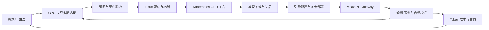
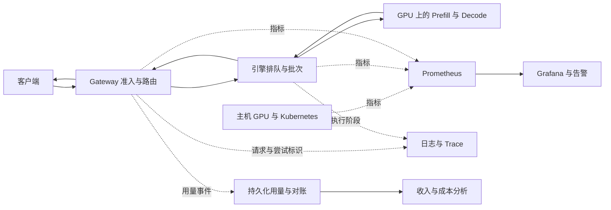
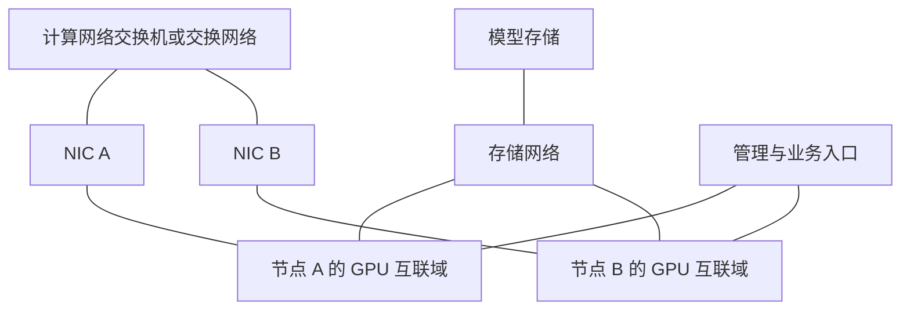

# AI Infra 全流程知识骨架：从 GPU 选型到 Token 交付与经营核算

> **适用对象**：具备编程、操作系统、网络和基础线性代数知识；不要求深度学习、CUDA 或 Kubernetes 实践经验。
>
> **学习目标**：理解完整链路与模块关系，知道各阶段要配置什么、用什么证据验收，以及如何将服务产出换算为成本和收益。
>
> **技术主线**：NVIDIA GPU → Ubuntu 24.04 LTS → containerd → Kubernetes → vLLM → MaaS／API Gateway → Prometheus／Grafana。补充 AMD、昇腾和其他引擎的职责对应与差异入口。
>
> **示例性质**：本文是工程骨架加示例，不是一键安装手册。命令、配置和查询用于说明关键连接点，未在真实 GPU 集群执行；执行前需满足所在小节的前置条件。算例中的硬件成本、吞吐和售价均为教学假设。

## 阅读方式、建设流程与知识地图

先用第 1～2 章理解一个文本大模型请求，再沿第 3～14 章完成需求、建设、部署、测量与核算。原有基础解释保留在对应章节；各章的“前置与衔接”说明知识依赖，工程上可并行推进的工作不必等待读到该章才开始，例如监控应随平台接入。

| 章节 | 核心内容 | 阶段产物或证据 |
| --- | --- | --- |
| [1. AI Infra 全貌与模型基础](#chapter-1) | 张量、模型、训练／微调／推理 | 能说明计算与工作负载 |
| [2. 请求执行、资源消耗与指标](#chapter-2) | Prefill、Decode、KV、显存、延迟与吞吐 | 请求图、资源粗模型、指标定义 |
| [3. 业务需求与初步容量](#chapter-3) | 请求画像、SLO、预算与候选规模 | 需求表和待验证方案 |
| [4. GPU、服务器与机房选型](#chapter-4) | 算力、带宽、整机、供电与散热 | 候选比较表、物料与验收计划 |
| [5. 集群组网、拓扑与通信](#chapter-5) | 互联、网络平面、RDMA、NCCL | 拓扑图、链路和通信基线 |
| [6. Linux、驱动与容器安装](#chapter-6) | 系统、驱动、运行库、容器 | 可复现环境、GPU 容器验证 |
| [7. Kubernetes GPU 平台](#chapter-7) | 集群、网络、存储、设备与调度 | 可分配 GPU 和 GPU Pod 验证 |
| [8. 模型下载与制品优化](#chapter-8) | 下载、校验、分发、量化 | 固定版本的可部署制品 |
| [9. 推理引擎部署与调参](#chapter-9) | 单实例、缓存、批次、参数 | 基线配置和对照实验 |
| [10. 多机多卡与阶段分离](#chapter-10) | 副本、并行、PD 与协调 | 进程／资源布局和扩展验证 |
| [11. MaaS 与 API Gateway](#chapter-11) | 模型服务管理、路由、配额与交付 | 服务入口、发布和用量链路 |
| [12. 可观测性与诊断](#chapter-12) | 采集、发现、查询、看板与告警 | 指标字典、采集目标与看板 |
| [13. 压测与生产容量校准](#chapter-13) | 性能、质量、故障与容量曲线 | 可复现报告和资源配置 |
| [14. Token 产能、成本与收益](#chapter-14) | 两阶段成本、缓存、定价与毛利 | 可复算的成本和收益表 |

**建设流程图**：箭头表示主要交付衔接，基础知识在前两章学习；监控和质量验证贯穿部署。



**请求、观测和用量的数据流**：实线表示请求或输出，虚线表示观测／事件；基础设施指标与业务计费事件用途不同。



**示例输入约定**：Shell 中的大写变量是读者根据环境填写的输入，并非推荐值；需传给子进程的变量用 `export` 导出，尤其是 `envsubst` 使用的模板变量。软件版本记录安装包版本，镜像记录 tag 和 digest，模型记录不可变 revision；`MODEL_DIR` 为目标节点上的绝对路径。`NODE_A`／`NODE_B` 是集群节点的可达地址，`POD_CIDR` 不得与主机或 Service 网段重叠。Kubernetes、容器运行时和推理引擎版本须按官方支持矩阵联合选择。

<a id="chapter-1"></a>
<a id="module-1"></a>

## 1. AI Infra 全貌与模型基础

**核心问题**：模型执行什么计算，基础设施承担哪些职责？

**前置与衔接**：从程序、内存、进程和网络知识出发，为第 2 章的执行与资源模型建立基础。

### 1.1 应用、模型与基础设施的分工

应用组织业务流程；模型根据输入执行计算；Infra 提供计算资源、运行环境、数据通路和服务交付能力。RAG（检索增强生成）的检索与重排、Agent 的多轮调用，都会改变模型请求的数量、长度和到达方式。

### 1.2 张量、形状与数值精度

张量可以先理解为带有形状和数据类型的多维数组。矩阵乘法是常见核心计算；形状决定运算规模，FP32、BF16、FP16 等数据类型影响占用、数值范围和计算支持。

### 1.3 参数、前向计算与训练

模型权重是学习得到的参数；前向计算用参数和输入产生中间结果及输出，层间的中间表示常称为激活。训练还包含损失计算、反向传播与参数更新，需考虑梯度和优化器状态；推理主要使用已有参数完成前向计算。

### 1.4 文本模型的最小结构

Token 是文本编码后的基本单位；Embedding 将 Token 映射成向量。Transformer 通过 Attention（注意力）、前馈网络等模块处理表示，结合位置信息产生候选 Token 的分数。自回归生成把已生成内容继续作为上下文。

Dense（稠密模型）与 MoE（混合专家模型）是结构选择。MoE 的总参数量和每个 Token 激活的参数量不同：前者影响权重存储，后者帮助理解计算量；具体部署在第 10 章与专题 D 展开。

### 1.5 训练、微调与推理的工作负载差异

| 工作负载 | 主要执行过程 | 主要状态与数据通路 | 通信与恢复关注点 |
| --- | --- | --- | --- |
| 训练／微调 | 数据读取、前向、反向、参数更新；微调可只更新部分参数 | 参数、中间结果、梯度、优化器状态；持续读取训练数据 | 多卡同步或状态分片；通过 Checkpoint 保存和恢复训练进度 |
| 在线推理 | 请求到达后生成结果，关注响应时间 | 常驻权重、请求状态、KV Cache；输入和输出随请求流动 | 模型并行时需要通信；实例失败涉及在途请求和状态恢复 |
| 离线推理 | 按任务批量处理输入并保存结果 | 常驻权重、任务批次、结果文件；批量读写数据 | 可按任务分片扩展；关注任务完成时间、部分失败和重跑 |

Embedding、重排与生成式模型的输出形式不同，不能都套用逐 Token 生成的性能模型。多模态还会增加图像、音频或视频的预处理和编码阶段；它们均可用于在线或离线场景。

**验收与理解检查**：能够比较同一模型训练与推理的显存组成、输入输出和恢复方式。

**常见问题**：把模型权重当成完整服务；用生成 Token 的口径衡量所有 AI 任务。

**深入入口**：[PyTorch 基础](https://docs.pytorch.org/tutorials/beginner/basics/quickstart_tutorial.html)；[专题 A：训练与产物](#topic-a)。

<a id="chapter-2"></a>
<a id="module-2"></a>

## 2. 请求执行、资源消耗与性能指标

**核心问题**：请求如何变成输出，哪些计算和状态消耗资源？

**前置与衔接**：保留请求、指标与显存基础。第 3 章用它们粗估容量，第 4 章映射到硬件，第 9 章解释引擎实现。

### 2.1 请求输入与预处理

解析请求，按 Chat Template（对话模板）组织消息，通过 Tokenization 转成 Token 序列。输入长度包含模板和历史上下文；文本字符数与 Token 数不是同一个量。可用上下文长度约束输入与后续生成的总长度。

### 2.2 Prefill：处理输入并建立上下文状态

Prefill（预填充）对输入上下文做前向计算。Attention 中的 Key 和 Value 是从 Token 表示计算得到的向量；KV Cache 保存各层已处理 Token 的这些结果，供后续生成复用。处理完输入后，可从输出分数中选择第一个生成 Token。

### 2.3 Decode：利用已有状态逐步生成

Decode（解码）迭代处理新生成的 Token，读取历史 KV、写入新增 KV，并产生下一个 Token 的分数。缓存避免重复计算历史 Token 的 K/V，但后续 Attention 仍需访问相应历史状态。

### 2.4 采样、停止与输出

根据分数选择下一个 Token，可采用贪心选择或温度、Top-k／Top-p 等采样策略。遇到结束标记、长度限制或取消时停止；Detokenization 将 Token 转回文本，流式接口逐步交付结果。网络中的一个输出片段可能包含多个 Token。

### 2.5 延迟：先返回与持续生成是两个问题

- TTFT（首 Token 延迟）：从发出请求到收到第一个输出 Token 的时间，可能包含排队、预处理和 Prefill。
- ITL（相邻 Token 间隔）与 TPOT（首 Token 之后的平均每 Token 耗时）：分别描述生成过程中的间隔与平均速度；统计分位数和平均值不能混用。
- 端到端延迟：请求发出到结果完成的时间。必须说明测量点；客户端看到的延迟可能包含网络与缓冲开销。

### 2.6 吞吐、并发与服务目标

RPS 是每秒请求数；Token 吞吐应分别说明输入与输出，统一用 Token/s 表达。并发是在途请求数，到达率是单位时间进入的请求数；两者与排队和处理时间有关。

SLO（服务级目标）规定质量、延迟或成功率要求。Goodput（有效吞吐）只统计满足事先声明的条件的产出，因此提高总吞吐未必提高有效吞吐。第 13 章定义具体统计口径和测试方法。

### 2.7 推理显存由什么组成

```text
权重字节数粗估 = 总参数量 × 每参数存储位数 ÷ 8
单卡运行显存 = 本卡常驻权重 + KV／模型状态 + 中间结果与工作区
             + 通信等运行时缓冲 + 分配余量
```

例如 70 亿参数按每参数 2 字节存储，权重本身约 14 GB（十进制），运行还需其他空间。量化元数据、加载期间的临时副本也会影响峰值；MoE 不能只按激活参数量估算全部常驻权重。

### 2.8 KV 容量与上下文、并发的关系

对各层结构相同、缓存完整 K/V 的常规 Attention：

```text
每个已缓存 Token 的 KV 字节数
  = 2 × 层数 × KV Head 数 × 每个 Head 的维度 × 每个元素的字节数
总 KV 字节数粗估 = 每 Token KV 字节数 × 所有驻留序列已缓存长度之和
```

Head 表示一组注意力表示。MHA（多头注意力）为各查询头配备 K/V，GQA（分组查询注意力）和 MQA（多查询注意力）让多个查询头共享 K/V，因此 KV Head 数会不同。

驻留长度随输入及已处理的生成内容变化。共享前缀、分页取整和缓存保留策略会改变实际占用；多卡分片及其他状态结构不能直接套用单卡公式，分别见第 10 章和专题 C。

一条重要的因果关系是：上下文或驻留请求增加 → KV 占用增加 → 固定显存下的可接纳容量受限 → 排队和延迟可能上升 → 满足 SLO 的容量与成本变化。复用和压缩等策略会改变这条关系中的具体数值。

**验收与理解检查**：能画出请求链路，区分 TTFT 与持续生成速度，按模型结构估算权重和 KV。

**常见问题**：把输入字符数当 Token 数；把磁盘权重大小当运行显存；把网络片段数当输出 Token 数。

**深入入口**：[文本生成](https://huggingface.co/docs/transformers/llm_tutorial)、[KV 原理](https://huggingface.co/docs/transformers/cache_explanation)；[专题 C](#topic-c)。

<a id="chapter-3"></a>

## 3. 业务需求与初步容量规划

**核心问题**：建设什么服务，需要多少资源，哪些假设尚待验证？

**前置与衔接**：先使用第 2 章的模型与指标；本章形成候选，第 13 章用实测完成容量校准。

### 3.1 描述负载与验收目标

记录输入／输出长度的联合分布、到达率、并发、突发、取消和多轮复用，以及模型版本、质量门槛、延迟分位数与成功率目标。短问答、长文档与多轮 Agent 不能仅凭一个平均长度代表。

### 3.2 明确服务目标与建设约束

SLO 需声明测量点、请求集合、阈值、统计分位数与时间窗口，分别定义成功、拒绝、取消和失败。记录模型质量要求、可用性、预算、自建／租赁、供货、功率和软件生态限制。

| 需求输入 | 示例记录方式 | 影响的决策 |
| --- | --- | --- |
| 模型与精度 | revision、总参数、Attention 结构、量化容忍度 | 显存、内核与引擎支持 |
| 请求长度 | 输入／输出联合分布、上下文上限 | KV、批次和 P／D 配比 |
| 流量与复用 | 平峰请求率、突发时长、前缀命中 | 副本、排队、缓存 |
| 质量与体验 | 任务指标、p95 TTFT／ITL、成功率 | 合格容量与验收 |
| 连续性 | 可接受故障域、维护窗口 | 冗余、工作组和发布 |
| 经济约束 | 预算、采购／租赁、运营期间 | 选型与第 14 章成本模型 |

### 3.3 资源粗估与候选配置

先粗估权重、上下文与并发所需显存，再结合计算、带宽及软件支持形成 GPU／NPU 和服务器候选。预算、自建／租赁、功率和散热是约束；GPU 数量与冗余数量最终由第 13 章的实测容量和故障余量决定。

### 3.4 把粗估与承诺分开

显存先判断“能否放下”，计算量、带宽和通信帮助判断可能的瓶颈，但都不能独立给出真实并发和吞吐。初步表记录 GPU／实例数量、并行方案、缓存假设、峰值与故障余量，并标注每个值来自公式、历史基线还是目标测试。

若已有同负载、同配置的单实例合格能力，可粗估 `所需副本数 = ceil(目标负载 / 单副本合格能力)`；上线前还要测路由、共享资源竞争和故障后的剩余容量。

### 3.5 划分验证任务

选型阶段验证模型和硬件兼容、单实例基线及网络要求；部署阶段验证实际配置；运营阶段检查请求分布、价格与资源成本变化。每项假设给出对应的指标和实验条件，形成第 4～14 章共同使用的需求档案。

**验收与理解检查**：产出一页需求表，能指出哪些数量是粗估、哪些必须通过测试确定。

**常见问题**：用平均长度掩盖长尾；用一张卡的峰值吞吐直接承诺整个平台容量。

**深入入口**：第 [13 章容量校准](#chapter-13)、第 [14 章经济模型](#chapter-14)。

<a id="chapter-4"></a>
<a id="module-3"></a>

## 4. GPU、服务器与机房选型

**核心问题**：怎样把目标模型、负载和部署约束转成硬件方案？

**前置与衔接**：使用第 2～3 章的资源和需求；第 5 章确认互联，第 6～7 章验证运行环境。

### 4.1 GPU 的计算能力

GPU 利用大量并行执行单元处理计算，矩阵计算单元加速适用的矩阵运算。区分运算量、峰值算力和实际有效算力；实际速度还受算子、数据类型、数据搬运和工作规模影响。

### 4.2 显存容量、带宽与计算强度

显存容量决定能同时放多少数据，带宽决定搬运数据的速度。HBM／GDDR 是不同的显存技术；片上缓存与存储又影响数据复用。计算强度表示每搬运一定量数据完成多少运算，用于理解计算受限与访存受限。

较大的 Prefill 批次常有较高计算强度，小批次 Decode 常受权重或 KV 访存影响；这是需用负载验证的倾向，不能把两阶段固定等同于两类瓶颈。

### 4.3 服务器中的数据通路

CPU 承担请求处理、预处理与任务提交；主机内存、存储和 GPU 显存承载不同阶段的数据。理解 PCIe、网卡（NIC）、本地 NVMe 存储的连接关系，以及 NUMA（非统一内存访问）下访问位置对代价的影响。

本章关注数据经过哪些硬件；模型加载的软件步骤见第 8 章，GPU 间互联见第 5 章，多节点放置见第 10 章。

### 4.4 GPU 与整机比较表

从候选中排除不满足显存、精度、模型或引擎支持的方案，再比较目标负载下的有效产出。以下 A／B 栏填写目标 SKU 的官方资料和实测结果，不以空白表推导排名。

| 维度 | 候选 A／B 应填写的内容 | 证据与检查 |
| --- | --- | --- |
| GPU 计算与精度 | 目标精度支持、实际矩阵／Attention 表现 | 模型与内核适配、微基准 |
| 显存 | 容量、带宽、ECC、运行时可用量 | 权重／KV／工作区与峰值 |
| GPU 形态与互联 | PCIe／模组、GPU 间链路和互联域 | 官方拓扑、P2P 与集合通信 |
| CPU 与内存 | 核数、内存通道／容量、NUMA | 预处理、提交与加载能力 |
| NIC 与扩展槽位 | 端口数量／带宽、PCIe 宽度、GPU—NIC 路径 | 避免 NIC 或槽位成为瓶颈 |
| 存储 | 本地 NVMe 容量、共享分发与加载时间 | 冷启动、多实例同时加载 |
| 建设与交付 | 整机功率、散热、机柜、价格、交期与维保 | 预算、机房与验收清单 |
| 综合结果 | 指定负载下合格吞吐和期间成本 | 第 13～14 章的统一口径 |

### 4.5 供电、散热与机柜约束

供电按整机、网络、存储及相应冗余设计，GPU TDP 不能代替机房总功率。检查风冷／液冷需求、冷板系统与残余风冷、机柜承重与空间、供回水及维护条件、布线和维修通道。配置能安装、能持续散热，才有条件讨论持续有效算力。

物料清单包括服务器、网卡、交换机、线缆／光模块、存储、配电和所需备件；逐项关联供货、安装责任、验收与维保。

### 4.6 硬件基线、采购验收与异构映射

验收记录设备型号／序列号、固件、链路、错误、功率和持续压力下的数值正确性及性能波动。软件安装后执行单卡计算、GPU P2P 和通信测试；发现降速先核对温度、功率和实际链路宽度。

| 职责 | NVIDIA 主线 | AMD／昇腾对应入口 |
| --- | --- | --- |
| 计算与运行库 | CUDA 与相关库 | ROCm／CANN |
| 通信 | NCCL | RCCL／HCCL |
| 设备与观测 | NVIDIA 驱动、nvidia-smi、DCGM | 对应驱动、AMD SMI／npu-smi 和厂商采集工具 |
| 容器与编排 | Container Toolkit、GPU Operator | 各厂商容器接入和设备插件 |

名称相似不意味着模型、内核或版本兼容；迁移需要重复功能、质量和性能验收。

**验收与理解检查**：选型结论能追溯到模型要求、拓扑、持续功率和合格吞吐；提交比较表及验收记录。

**常见问题**：只比峰值 FLOPS；忽略 PCIe／NUMA 或 NIC 位置；用标称 TDP 估算全部电费。

**深入入口**：[NVIDIA DGX 系统资料](https://docs.nvidia.com/dgx/dgxgb200-user-guide/)；[专题 G](#topic-g)。

<a id="chapter-5"></a>

## 5. 集群组网、拓扑与分布式通信

**核心问题**：多卡计算如何交换数据，怎样设计和验证连接？

**前置与衔接**：先从分片理解通信需求，再落到网络；第 6 章安装软件，第 10 章将拓扑用于部署。

### 5.1 先理解计算分片为何产生通信

张量并行（TP）拆分层内计算与参数，通常需要频繁交换或合并结果；流水线并行（PP）把不同层放到不同设备，需要阶段交接，并受流水线空闲时间影响。每卡权重和 KV 的分片或复制规则要按实际实现分析。

### 5.2 从计算分片理解通信

点对点传输负责指定进程间的数据交换；AllGather 汇集分片，AllReduce 聚合并分发结果，ReduceScatter 聚合后分发分片。先理解计算为什么需要这些操作，再认识 NCCL 等通信库。Rank 是通信参与进程的编号，进程组规定共同参与通信的成员。

### 5.3 从通信需求理解互联

互联需要同时考虑带宽、延迟与拓扑。Scale-up 通常关注紧耦合互联域，Scale-out 关注向更多节点扩展；具体边界取决于系统，不能简单等同于单机和跨机。

NVLink／NVSwitch 用于相应 GPU 互联；以太网与 InfiniBand 是网络技术。RDMA 是远端内存访问机制，RoCEv2 是在以太网上承载 RDMA 的协议；这些概念处于不同层面。模型通信、存储分发与业务流量还可能竞争网络资源。

### 5.4 网络平面与组网设计

分别标注管理、业务、计算和存储流量的源、目的、规模和优先级；可物理分网，也可逻辑隔离，但共享链路必须计入竞争。记录交换机层级、端口速率、上下联带宽、超售比、冗余、IP／路由、MTU 和线缆规格。



图示为逻辑连接，实际可能使用不同网卡或共享端口。Leaf-Spine、Rail-aligned 等布局用于具体规模和通信模式，先看端到端路径再深入网络方案。

### 5.5 RDMA 通路与通信软件

明确 GPU → PCIe／互联 → NIC → 网络 → 对端 NIC → GPU 的路径。GPUDirect RDMA 让 NIC 在支持条件下访问 GPU 内存，仍需匹配硬件、驱动、内核模块和内存注册机制。RoCE 的 ECN／PFC、队列和拥塞控制是端到端配置，不能把几个开关当成通用配方。

NCCL 可选择不同传输，必须检查实际使用的接口与传输路径。`NCCL_SOCKET_IFNAME` 选择 socket 网络接口，`NCCL_IB_HCA` 选择 RDMA 设备，二者并非同一个配置项。NCCL 日志说明连接与算法；MPI 可用于启动测试进程，不代表推理服务必须使用 MPI。

### 5.6 逐层验证与通信基线

依次检查设备识别、GPU 计算、单机 P2P、跨机连接与带宽、集合通信，最后运行模型。主机、容器和 K8s 中分别检查实际可见设备，不能用主机通过代替 Pod 通过。

```bash
nvidia-smi topo -m
lspci -tv
ip -br addr
rdma link
ibv_devinfo
```

前置：上述工具已安装。RDMA 读写带宽测试需在双方运行兼容版本的 perftest，匹配设备、端口及消息大小；然后用编译启用 MPI 的 NCCL Tests 测真实集体通信。下面按两节点、每节点四个进程、每进程一张 GPU 举例，要求 MPI 可启动远程进程且测试文件路径一致。

```bash
: "${NODE_A:?填写节点 A 地址}"
: "${NODE_B:?填写节点 B 地址}"
mpirun -np 8 --host "${NODE_A}:4,${NODE_B}:4" \
  /opt/nccl-tests/build/all_reduce_perf -b 8M -e 1G -f 2 -g 1
```

记录正确性、延迟、算法／总线带宽、消息大小、rank 数和 NIC 路径。通用 IP 可达只证明部分通路正常，不证明 RDMA 或目标带宽正常。

**验收与理解检查**：能沿拓扑解释一次集合通信的路径，并提交单机与跨机通信基线。

**常见问题**：RoCE、以太网和 RDMA 混为同一层；只测 ping；通信悄然走 socket；多流量共享造成拥塞。

**深入入口**：[NCCL Tests](https://github.com/NVIDIA/nccl-tests)、[NVIDIA 网络架构](https://docs.nvidia.com/dgx-superpod/reference-architecture-scalable-infrastructure-gb200/latest/network-fabrics.html)；[专题 E](#topic-e)。

<a id="chapter-6"></a>

## 6. Linux、GPU 驱动与容器环境安装

**核心问题**：怎样从一台裸机获得可复现的 GPU 容器执行环境？

**前置与衔接**：硬件和网络规划在第 4～5 章；本章完成主机基线，第 7 章再接入 Kubernetes。

### 6.1 软件栈各层负责什么

| 层次 | 主要职责 | 实现示例 |
| --- | --- | --- |
| 主机系统与驱动 | 管理进程、内存和设备，提供设备访问 | Linux、GPU 驱动 |
| 加速计算平台与运行库 | 提供设备编程、内存管理和执行接口 | CUDA、ROCm、CANN 生态 |
| 数学与通信库 | 实现常用计算或跨设备通信 | cuBLAS、NCCL |
| 模型框架 | 表达张量计算、模型结构与训练过程 | PyTorch |
| 推理引擎 | 组织模型执行、请求批次与运行状态 | vLLM、SGLang、TensorRT-LLM |

这些是职责划分，实际依赖可以交叉：引擎可能使用框架，也可能直接调用计算库或专用内核。容器负责封装环境，不替代驱动、框架或引擎。

### 6.2 Linux 安装与主机基线

以 Ubuntu 24.04 LTS 为说明环境。安装前检查启动盘／数据盘、网卡、主机名、IP／路由、DNS、NTP、软件源与访问路径；安装后记录内核、分区挂载、资源限制和日志位置。保留 BIOS／固件基线，按拓扑处理 NUMA 和 CPU／IRQ 亲和性。

准备与运行内核匹配的 headers 和模块构建依赖；根据目标驱动处理开放／专有内核模块、已有冲突模块以及 Secure Boot 签名。避免通过统一关闭安全机制或批量套 sysctl 掩盖兼容问题。安装顺序为 Linux → GPU 驱动 → containerd → Container Toolkit → 容器验证。

```bash
uname -r
lscpu
numactl --hardware
lsblk -f
timedatectl status
ip route
```

记录 cgroup 版本、内存与文件句柄限制。Kubernetes 对 swap、转发、cgroup driver 和内核模块的要求应随选定版本及 CNI 核对。

### 6.3 GPU 驱动、CUDA 与互联组件

优先使用发行版适配的软件包路径。先按 GPU 架构、操作系统和 CUDA 兼容要求选定驱动分支及安装包，再安装、必要时重启，并验证模块和设备。下例中的 `GPU_DRIVER_PACKAGE` 必须是已配置软件源中的完整包名和锁定版本（`包名=版本`），不指向任意最新驱动。

```bash
: "${GPU_DRIVER_PACKAGE:?设置已核对的驱动包名和版本}"
sudo apt-get install "linux-headers-$(uname -r)"
sudo apt-get install "$GPU_DRIVER_PACKAGE"
nvidia-smi
```

驱动提供设备访问；CUDA Runtime 是程序运行依赖；CUDA Toolkit 还包含编译器等开发工具。只运行已构建镜像不等于宿主机必须安装完整 Toolkit。`nvidia-smi` 中的 CUDA Version 表示驱动支持的 CUDA 能力上限，不能代替容器内运行库版本检查。

使用 NVSwitch、RDMA 或 GPUDirect 时，按平台安装匹配的 Fabric Manager／互联管理、NIC 驱动、固件和所需模块，并重复第 5 章的通路检查。安装步骤与版本锁定参考 [NVIDIA 驱动指南](https://docs.nvidia.com/datacenter/tesla/driver-installation-guide/latest/)。

### 6.4 containerd 与 NVIDIA Container Toolkit

从经过核对的软件源安装并锁定 containerd；启用 CRI，确认 containerd 与后续 kubelet 的 cgroup driver 一致。NVIDIA Container Toolkit 负责向容器提供所需设备和驱动库；它不是另一套 Kubernetes。

前置：已按 [Container Toolkit 官方指南](https://docs.nvidia.com/datacenter/cloud-native/container-toolkit/latest/install-guide.html)配置签名软件源，`NCT_VERSION` 是该源中验证过的包版本。主线将 NVIDIA runtime 设为 containerd 默认运行时，供第 7 章的预安装模式接入；在已有主机上变更前先保存配置。

```bash
: "${NCT_VERSION:?设置 Container Toolkit 包版本}"
sudo apt-get install \
  "nvidia-container-toolkit=${NCT_VERSION}" \
  "nvidia-container-toolkit-base=${NCT_VERSION}" \
  "libnvidia-container-tools=${NCT_VERSION}" \
  "libnvidia-container1=${NCT_VERSION}"
sudo nvidia-ctk runtime configure --runtime=containerd --set-as-default
sudo systemctl restart containerd
systemctl is-active containerd
```

OCI 描述容器运行约定，CRI 是 kubelet 与容器运行时的接口，CDI 描述设备注入。使用 CDI 或 RuntimeClass 的方案需与所选 Kubernetes、运行时和设备插件配置一致，不同时复制多条接入路径。

### 6.5 主机与容器环境

理解进程如何访问 GPU、镜像包含什么、宿主机提供什么。保持依赖版本与构建可复现，记录驱动、计算库、框架、引擎和硬件的兼容关系；裸机或容器都可以运行模型实例。

建立版本矩阵：操作系统／内核 → GPU 与 NIC 驱动 → containerd／Container Toolkit → 容器镜像与 CUDA 库 → 框架／通信库／引擎。记录配置、镜像 digest 和升级回滚方式。

### 6.6 主机、容器与计算验证

依次证明“主机可见 GPU”“容器可见 GPU”“容器能执行计算”。前置：安装 nerdctl，主线访问由系统管理的 containerd；`CUDA_IMAGE` 为兼容驱动的固定 CUDA 镜像引用，`ENGINE_IMAGE` 为固定且含 PyTorch 的推理镜像；两个变量都使用明确 tag 或 digest。

```bash
: "${CUDA_IMAGE:?设置已核对的 CUDA 镜像引用}"
: "${ENGINE_IMAGE:?设置已核对的推理镜像引用}"
sudo nerdctl run --rm --gpus=all "$CUDA_IMAGE" nvidia-smi
sudo nerdctl run --rm --gpus=all --entrypoint python "$ENGINE_IMAGE" -c \
  'import torch; assert torch.cuda.is_available(); x=torch.ones((16,16),device="cuda"); y=x@x; torch.cuda.synchronize(); assert torch.all(y==16).item(); print("GPU compute OK")'
```

这个小计算仅验证运行通路，不能替代 DCGM、显存压力、持续稳定性或模型质量验收。分别保存主机与容器的设备、库和计算结果，再进入 Kubernetes。

**验收与理解检查**：提交版本矩阵与主机／容器计算证据；能区分驱动、CUDA Runtime、Toolkit 和容器工具。

**常见问题**：驱动模块与内核不匹配；驱动显示正常但容器无设备；容器可见设备但运行库不兼容；运行时配置未被读取。

**深入入口**：[Container Toolkit](https://docs.nvidia.com/datacenter/cloud-native/container-toolkit/latest/install-guide.html)；[专题 G](#topic-g)。

<a id="chapter-7"></a>

## 7. Kubernetes GPU 算力平台

**核心问题**：如何把 GPU 主机变成可发现、可分配、可运维的集群资源？

**前置与衔接**：以第 6 章通过验证的节点为输入；接入监控从本章开始，第 12 章集中说明采集。

### 7.1 区分三层调度

| 层次 | 管理对象 | 要做的决定 |
| --- | --- | --- |
| 集群资源调度 | 模型实例、作业、GPU 等资源 | 哪个实例或作业使用哪些设备，何时能够启动？ |
| 网关路由与准入 | 请求、后端实例 | 是否接收请求，交给哪个实例？ |
| 引擎内部调度 | 实例中的请求与 Token | 下一轮 GPU 计算处理哪些工作？ |

一个请求只有被接收到实例后，才进入第 9 章的引擎调度。实例等待分配资源与请求等待执行，是不同的队列。

### 7.2 集群安装、网络与存储

理解控制面 API Server／etcd／调度器、工作节点 kubelet／containerd，以及 Pod、Deployment、Service 和 Namespace。先统一 containerd、kubelet 的 cgroup 设置和软件版本，准备控制面地址、Pod／Service 网段、证书与节点连通。

教学主线用 kubeadm 引导，Calico 作为 CNI 示例；生产还需控制面高可用、etcd 备份和证书维护。下例仅展示关键命令，执行前按 [kubeadm 安装文档](https://kubernetes.io/docs/setup/production-environment/tools/kubeadm/install-kubeadm/)安装锁定版本的 kubeadm、kubelet、kubectl，并准备与 Pod 网段匹配的固定版本 Calico 清单。

```bash
: "${K8S_VERSION:?设置已核对的 Kubernetes 版本}"
: "${POD_CIDR:?设置无冲突的 Pod 网段}"
sudo kubeadm init --kubernetes-version "$K8S_VERSION" --pod-network-cidr "$POD_CIDR"
```

初始化后配置管理员 kubectl 上下文；工作节点按此次初始化生成的 join 参数加入，不复用文档中的虚构 token。随后在管理员上下文执行：

```bash
: "${CALICO_MANIFEST:?设置已固定版本并适配网段的本地 Calico 清单路径}"
kubectl apply -f "$CALICO_MANIFEST"
kubectl get nodes -o wide
kubectl get pods -n kube-system
```

验证 CNI、CoreDNS、Pod 跨节点通信与 Service 访问。CNI 解决 Pod 网络，不自动提供 RDMA；RDMA 设备暴露和网络接入另按设备插件、Network Operator 或目标平台方案配置。模型存储需区分对象存储下载、本地缓存和 PVC／CSI，共享卷还要检查访问模式与加载并发。

### 7.3 GPU Operator 与设备注册

主线由宿主机管理已安装的驱动和 Container Toolkit，Operator 管理设备发现、插件、验证及相关组件。禁止再次独立安装另一套同职责 Device Plugin。预安装模式要核对默认 runtime 和 Operator 的支持矩阵。

```bash
: "${GPU_OPERATOR_VERSION:?设置已核对的 GPU Operator Chart 版本}"
helm repo add nvidia https://helm.ngc.nvidia.com/nvidia
helm repo update
helm upgrade --install gpu-operator nvidia/gpu-operator \
  --namespace gpu-operator --create-namespace \
  --version "$GPU_OPERATOR_VERSION" \
  --set driver.enabled=false --set toolkit.enabled=false \
  --set dcgmExporter.serviceMonitor.enabled=false --wait
kubectl get pods -n gpu-operator
kubectl get clusterpolicy
kubectl get nodes -o json | jq '.items[] | {node:.metadata.name, gpu:.status.allocatable["nvidia.com/gpu"]}'
```

这里先部署 DCGM Exporter，暂不创建 ServiceMonitor；第 12 章安装监控 CRD 后再接入抓取。需要区分节点物理 GPU 数、注册的可分配资源和实际已分配资源；共享／MIG 模式会改变资源表示。NFD 已安装时按 Chart 文档关闭重复部署。替代方案是在全新节点上让 Operator 统一安装驱动和 Toolkit，两条路径只选择一个管理归属。[官方预安装场景](https://docs.nvidia.com/datacenter/cloud-native/gpu-operator/latest/getting-started.html)

### 7.4 最小 GPU Pod 与计算验收

以下 Pod 请求一张整卡。前置：默认 NVIDIA runtime 已配置、设备插件正常，并已建立 `ai` Namespace。示例镜像引用来自 GPU Operator 示例；容器内 Ubuntu 版本不必等于宿主机版本，仍需核对驱动与 CUDA 兼容性。

```yaml
apiVersion: v1
kind: Pod
metadata:
  name: gpu-check
  namespace: ai
spec:
  restartPolicy: Never
  containers:
    - name: compute
      image: nvcr.io/nvidia/k8s/cuda-sample:vectoradd-cuda12.5.0-ubuntu22.04
      resources:
        limits:
          nvidia.com/gpu: 1
```

将清单保存为 `gpu-check.yaml` 后运行：

```bash
kubectl create namespace ai --dry-run=client -o yaml | kubectl apply -f -
kubectl apply -f gpu-check.yaml
kubectl wait -n ai --for=jsonpath='{.status.phase}'=Succeeded pod/gpu-check --timeout=180s
kubectl logs -n ai gpu-check
```

检查分配到的节点、GPU 数和 `Test PASSED`。失败时先看 Pod Events，沿调度资源、镜像、runtime、设备插件和驱动逐层定位。

### 7.5 集群资源分配、共享与隔离

平台管理节点、设备健康、可分配资源与租户配额，可使用 Kubernetes 等编排系统。多卡实例还要求相关资源共同可用。GPU 独占、MIG 硬件分区、MPS 多进程并发和时间切片具有不同的共享与隔离边界，不应统称为等价的“切片”。

进一步认识 requests／limits、ResourceQuota、节点标签与污点、亲和性、拓扑约束及工作组整体调度。MIG、MPS、时间切片不能共享同一套隔离假设；GPU 分配成功也不代表 NIC／CPU 位置合理。

### 7.6 平台就绪与运行边界

检查节点 Ready、DNS、Service、镜像拉取、存储读写、GPU Pod 与跨节点通信，再把模型部署交给第 8～10 章。启动探测、就绪探测和存活探测职责不同；大型模型预热不能因过短探测而反复重启。

从平台安装阶段采集节点、Pod、GPU 和组件状态。扩缩容与升级需检查驱动／运行时管理权、可用容量、设备健康和在途任务；DRA、Topology Manager 和复杂多租户调度在专题 F 深入。

**验收与理解检查**：GPU 数能从硬件识别追溯到 Node allocatable、Pod 分配和真实计算结果；同时验证网络、DNS 和存储。

**常见问题**：Node Ready 但 GPU 未注册；Pod Pending 被误判为模型故障；CNI 正常但 RDMA 未接入；重复设备插件或驱动管理冲突。

**深入入口**：[GPU Operator](https://docs.nvidia.com/datacenter/cloud-native/gpu-operator/latest/getting-started.html)、[Calico 安装](https://docs.tigera.io/calico/latest/getting-started/kubernetes/quickstart)；[专题 F](#topic-f)。

<a id="chapter-8"></a>
<a id="module-4"></a>

## 8. 模型下载、存储与部署制品优化

**核心问题**：怎样得到完整、固定、可加载且质量合格的模型制品？

**前置与衔接**：第 1～2 章提供模型基础，第 6～7 章提供环境；制品交给第 9～10 章部署。

### 8.1 模型制品包含什么

权重、模型配置、Tokenizer、对话模板，以及模型所需的多模态处理器或 LoRA（低秩适配）适配器。文件必须相互匹配，来源与使用许可明确；训练 Checkpoint 可能还包含推理不需要的训练状态。

### 8.2 固定版本下载与内容校验

记录模型 ID、不可变 revision、来源、许可和必要授权。前置：安装锁定版本的 huggingface_hub CLI，下载目录容量足够；受限模型按来源完成授权，凭据通过环境或凭据管理传入，不写入命令示例或日志。

```bash
: "${MODEL_ID:?填写模型仓库 ID}"
: "${MODEL_REVISION:?填写模型不可变 revision}"
: "${MODEL_DIR:?填写本地绝对模型目录}"
hf download "$MODEL_ID" --revision "$MODEL_REVISION" --local-dir "$MODEL_DIR"
```

核对权重分片和索引、配置、Tokenizer、模板、处理器及适配器。生成并保存文件哈希清单，跨节点比对；自行生成的哈希可验证后续内容一致性，不等于证明上游来源可信。下载示例依据 [Hugging Face Hub](https://huggingface.co/docs/huggingface_hub/guides/download)。

### 8.3 版本、存储与加载

固定模型版本、校验内容，将部署记录关联到实际文件。对象存储、共享文件系统和本地 NVMe 可承担分发或缓存；加载涉及读取、反序列化、必要的转换与设备放置。存储吞吐和并发读取会影响冷启动及批量扩容。

比较并发启动时共享存储吞吐、元数据负载、本地缓存命中与设备搬运。容器内路径和多节点文件版本要一致；已下载、可读取与已加载到 GPU 是三个不同状态。

### 8.4 量化策略、校准与质量验证

量化用较低精度表示权重、激活或 KV，以减少存储和数据搬运，收益取决于硬件及内核支持。理解校准数据、误差与质量回归；使用已有量化制品和自行实施量化是不同的工作深度。

采用现成量化制品时检查模型、格式、后端和硬件支持；自行量化时固定源模型、校准集、工具及参数，比较任务质量、长上下文行为、峰值显存与真实吞吐。PTQ／QAT、AWQ／GPTQ 和低精度格式实现进入专题 B。

### 8.5 制品兼容、编译与回退

部署制品关联源模型 revision、量化配置、Tokenizer／模板、引擎、镜像和目标 GPU 架构。编译缓存或专用引擎文件可能不能跨架构、版本或形状直接复用。原始制品与转换制品分别保留标识，失败时能回退到已验证版本。

训练 Checkpoint 需要识别权重分片、优化器状态和适配器，转换步骤参考专题 A；不要把只包含某个训练 rank 的文件当完整推理权重。

### 8.6 制品交付记录

记录“来源／revision → 原始文件校验 → 转换参数 → 目标文件校验 → 镜像与引擎 → 质量／性能结果”。模型仓库记录版本，部署系统记录当前实际运行的版本；别名只指向版本，不替代可追溯标识。

验收包括离线文件完整性、目标环境加载和小样本输出。上线前还需第 13 章的质量回归、压测与发布门槛。

**验收与理解检查**：给定同一份制品记录，能在目标环境复现文件、加载配置与基线输出。

**常见问题**：缺分片或模板；只比较文件大小；量化后只看显存下降；多节点使用不同 revision。

**深入入口**：[模型下载](https://huggingface.co/docs/huggingface_hub/guides/download)、[专题 A](#topic-a)、[专题 B](#topic-b)。

<a id="chapter-9"></a>
<a id="module-5"></a>

## 9. 推理引擎部署、机制与调参

**核心问题**：怎样建立单实例基线，再有依据地调节显存、吞吐与延迟？

**前置与衔接**：输入为第 8 章制品与第 6～7 章环境；第 10 章扩展，第 12～13 章提供观测与测试。

### 9.1 选择引擎并建立实例

根据模型、硬件、接口与必要功能选择引擎，再确定精度和基础运行配置。一个服务实例由承载模型的一组进程构成，可能使用一张或多张 GPU；实例数量不等于 GPU 数量。

主线使用 vLLM；SGLang、TensorRT-LLM 作为功能与后端差异入口。能力比较覆盖模型架构、量化、缓存、并行、流式接口和观测，不能假设每个功能可以任意组合。

### 9.2 从加载成功到功能基线

验证设备可用、文件匹配、模型加载、基本输出和接口调用，记录环境与基础性能。初始化、编译或预热未完成时，进程存活不代表可接流量；服务的就绪与发布流程见第 11 章。

前置：在锁定版本的 vLLM 环境中运行，模型可在单卡上容纳，输入长度不超过示例上限。下面的 4096、0.85、16 是教学起点，不是通用推荐参数。

```bash
: "${MODEL_DIR:?设置固定 revision 的本地模型目录}"
vllm serve "$MODEL_DIR" --served-model-name teaching-model \
  --host 0.0.0.0 --port 8000 --dtype auto \
  --max-model-len 4096 --gpu-memory-utilization 0.85 \
  --max-num-seqs 16 --max-num-batched-tokens 4096 \
  --enable-prefix-caching --enable-chunked-prefill
```

该后端用于受控集群网络，外部请求经第 11 章 Gateway 接入。先测固定请求和输出，再记录启动日志、实际 KV 容量、吞吐、TTFT 和显存。

### 9.3 先建立基线，再理解批处理

Batch（批次）把多个请求的计算组织到一起，以增加并行工作和数据复用。先观察目标负载的延迟、吞吐和显存，再决定要改善什么；批次变大可能改善吞吐，也可能增加等待与显存占用。

### 9.4 连续批处理与分块预填充

连续批处理在迭代之间加入新请求、移除已结束请求；引擎调度器决定这一轮处理哪些请求及多少 Token。分块预填充将长输入拆成多段参与调度，影响 Prefill 与 Decode 的资源竞争和延迟分配。

### 9.5 KV 分页与前缀复用

分页管理按块分配 KV 空间，减少预留浪费并支持共享；PagedAttention 是相关实现思路，不会自动降低一份标准 KV 的每 Token 理论字节数。前缀缓存复用匹配的历史计算，收益取决于命中与可复用长度；相似文本不等于可复用的相同前缀。

保留缓存也占空间。引擎需要在活跃请求、缓存保留和显存不足时的处理之间取舍；缓存公式的基础定义见第 2 章。

### 9.6 算子、编译与执行优化

算子描述数学计算，内核（Kernel）是设备上的具体实现。矩阵乘法与 Attention 内核影响执行效率；融合可减少中间数据搬运和执行开销。先理解计算与访存的变化，专用内核实现放到专题 B。

图编译对计算图进行转换并选择或生成实现；CUDA Graphs 捕获并重放设备工作提交，侧重减少提交开销，两者作用不同。CPU／GPU 工作重叠也可减少空等；动态形状、额外显存和准备时间会影响收益。

### 9.7 参数、代价与验证表

对同一模型、负载和版本建立基线，逐项改变参数，并保存回退配置。参数名称和默认行为以所选版本的 `vllm serve --help` 与[官方调参文档](https://docs.vllm.ai/en/latest/configuration/optimization/)为准。

| 参数／配置 | 解决的问题 | 代价或边界 | 对照指标 |
| --- | --- | --- | --- |
| `--max-model-len` | 可接收上下文边界 | 放宽长度可能增加 KV 压力，不能突破模型质量边界 | 拒绝率、KV、长文本质量 |
| `--gpu-memory-utilization` | 调整引擎显存预算 | 过高可能挤压其他分配，引发 OOM | 实际 KV 容量、峰值显存、错误 |
| `--max-num-seqs` | 控制同时处理的序列数 | 提高并发可能增加 KV 和排队后的延迟 | 吞吐、运行／等待请求、ITL |
| `--max-num-batched-tokens` | 控制一次批次的 Token 预算 | 改变 P／D 竞争与计算规模 | TTFT、ITL、批次、吞吐 |
| `--enable-chunked-prefill` | 拆分长输入参与调度 | 收益随长度和调度策略变化 | 长短请求 TTFT／ITL |
| `--enable-prefix-caching` | 复用相同前缀计算 | 保留缓存占用空间，命中不等于质量验证 | 命中 Token、KV、Prefill 时间 |
| `--dtype`、`--quantization`、`--kv-cache-dtype` | 匹配权重／计算／KV 精度 | 硬件和后端支持、数值误差 | 任务质量、显存、吞吐 |
| TP／PP 大小 | 拆分模型及计算 | 通信、分片规则与资源成本 | 扩展效率、尾延迟、每实例成本 |
| `--enforce-eager` | 对照图执行与 eager 路径 | 可辅助定位问题，但可能增加提交开销 | 冷启动、显存和稳态速度 |

不要把网关 TPM 额度、引擎批次 Token 预算与观测到的 Token/min 混成同一参数。

### 9.8 Kubernetes 单实例部署与 Service

以下是模板，保存为 `vllm.yaml.in`。前置：`ai` Namespace 已存在，指定节点有一张可用 GPU；固定模型已下载到该节点的 `MODEL_DIR`。使用 hostPath 是为了展示加载路径，生产分发可改为合适的 PVC 或下载缓存。这里的 CPU、内存和探测时间是教学值，需按模型调整。

```yaml
apiVersion: apps/v1
kind: Deployment
metadata:
  name: vllm
  namespace: ai
spec:
  replicas: 1
  selector:
    matchLabels:
      app: vllm
  template:
    metadata:
      labels:
        app: vllm
    spec:
      nodeSelector:
        kubernetes.io/hostname: "${GPU_NODE_NAME}"
      containers:
        - name: engine
          image: "${ENGINE_IMAGE}"
          command: ["vllm", "serve", "/models/model"]
          args: ["--served-model-name", "teaching-model", "--host", "0.0.0.0", "--port", "8000", "--max-model-len", "4096"]
          ports:
            - name: http
              containerPort: 8000
          resources:
            requests:
              cpu: "4"
              memory: 16Gi
            limits:
              memory: 16Gi
              nvidia.com/gpu: 1
          volumeMounts:
            - name: model
              mountPath: /models/model
              readOnly: true
            - name: shm
              mountPath: /dev/shm
          startupProbe:
            httpGet:
              path: /health
              port: http
            periodSeconds: 10
            failureThreshold: 120
          readinessProbe:
            httpGet:
              path: /health
              port: http
            periodSeconds: 5
      volumes:
        - name: model
          hostPath:
            path: "${MODEL_DIR}"
            type: Directory
        - name: shm
          emptyDir:
            medium: Memory
            sizeLimit: 2Gi
---
apiVersion: v1
kind: Service
metadata:
  name: vllm
  namespace: ai
  labels:
    app: vllm
spec:
  selector:
    app: vllm
  ports:
    - name: http
      port: 8000
      targetPort: http
```

Kubernetes 不会自动展开 YAML 中的 Shell 变量；先渲染并检查，且内存限制包含容器使用的内存型共享卷。

```bash
: "${GPU_NODE_NAME:?填写节点的 kubernetes.io/hostname 标签值}"
: "${ENGINE_IMAGE:?填写固定推理镜像}"
: "${MODEL_DIR:?填写该节点上的绝对模型目录}"
export GPU_NODE_NAME ENGINE_IMAGE MODEL_DIR
envsubst '${GPU_NODE_NAME} ${ENGINE_IMAGE} ${MODEL_DIR}' < vllm.yaml.in > vllm.yaml
kubectl apply --dry-run=server -f vllm.yaml
kubectl apply -f vllm.yaml
kubectl get pods,svc -n ai
kubectl logs -n ai deployment/vllm
```

确认启动、就绪和真实请求响应，再接入 Gateway；第 12 章复用这个 Service 的 `http` 端口采集 `/metrics`。

**验收与理解检查**：能复现单卡与单 Pod 基线；调参结论同时说明目标、代价、质量与负载范围。

**常见问题**：扩大批次只看吞吐；KV 命中率替代有效产出；模板变量未渲染；模型路径存在但版本不一致；CPU 内存或共享内存不足。

**深入入口**：[vLLM 优化](https://docs.vllm.ai/en/latest/configuration/optimization/)、[前缀缓存](https://docs.vllm.ai/en/stable/design/prefix_caching/)；[专题 B](#topic-b)、[专题 C](#topic-c)。

<a id="chapter-10"></a>
<a id="module-6"></a>

## 10. 多机多卡与阶段分离部署

**核心问题**：如何从单实例扩展到更多设备，并维持正确的进程、状态与服务关系？

**前置与衔接**：第 5 章提供通信与拓扑，第 7 章分配设备，第 8～9 章提供一致的制品和引擎。

### 10.1 先明确扩展的原因

显存装不下、单请求速度不足、总吞吐不足和可用性不足，是不同问题。先评估单卡或单实例，再选择单机多卡、多机或多个副本；更多 GPU 会引入资源、通信和协调成本。

### 10.2 服务副本与数据并行

对能独立执行的稠密模型实例，复制权重并分发不同请求，可以扩展总吞吐，但不会直接缩短某个请求内部的计算路径。推理中的数据并行（DP）需结合引擎定义理解；训练 DP 的梯度同步，以及 MoE 中可能共享专家的 DP 布局，不等于独立服务副本。

TP／PP 的基础分片原理见第 5.1 节。设计时区分每实例 GPU 数、实例／副本数和总 GPU 数，并记录权重、KV 和通信组的归属。

### 10.3 按模型结构、上下文或阶段继续拆分

MoE 可采用专家并行（EP），将专家分布到不同设备；上下文并行（CP）面向长序列或状态分片；Prefill／Decode 分离（PD）为两个阶段分配独立资源。它们分别引入专家路由、状态通信或跨实例 KV 交接，应按问题选择，具体组合进入专题 D。

### 10.4 两节点八 GPU 的 TP／PP 示例

教学目标布局为每节点四张 GPU，TP=4、PP=2，总共八张 GPU 承载一个模型实例；它不是八个独立副本。模型层数、Attention／KV Head 和后端必须支持相应切分。目标是节点内完成主要 TP 通信，节点间交接 PP 阶段，实际 placement 要从日志核对。

```text
节点 A：GPU 0–3 → PP 阶段 0 内的 TP=4
节点 B：GPU 0–3 → PP 阶段 1 内的 TP=4
一个服务实例 = 两个阶段 + 八个计算进程所用 GPU
```

主机或容器中使用相同版本的 vLLM／Ray、相同模型内容及绝对路径，配置可达的节点地址、端口和目标 NIC，并先通过通信测试。以下命令在各自环境中运行，Ray 集群只对受控集群网络开放。

节点 A 启动 Ray head：

```bash
: "${NODE_A:?填写节点 A 的集群地址}"
ray start --head --node-ip-address "$NODE_A" --port=6379
```

节点 B 加入：

```bash
: "${NODE_A:?填写节点 A 的集群地址}"
: "${NODE_B:?填写节点 B 的集群地址}"
ray start --address "${NODE_A}:6379" --node-ip-address "$NODE_B"
```

节点 A 确认 Ray 发现八张可分配 GPU 后启动：

```bash
: "${MODEL_DIR:?设置各节点相同的模型路径}"
ray status
vllm serve "$MODEL_DIR" --served-model-name teaching-model \
  --distributed-executor-backend ray \
  --tensor-parallel-size 4 --pipeline-parallel-size 2
```

Kubernetes 上可用 KubeRay 等方式管理 head／worker，但仍须声明每个 worker 的四张 GPU、节点位置、模型卷和所需通信设备。多个独立 Deployment 的 `replicas` 不会自动拼成 TP／PP 工作组；资源一起分配、通信可达与进程组一致性要分别验证。[vLLM 并行部署](https://docs.vllm.ai/en/latest/serving/parallelism_scaling/)

### 10.5 PD 资源池、KV 传输与阶段路由

PD 部署包含请求入口、Prefill 池、Decode 池和 KV 传输通路。双方必须对模型、精度、布局和传输协议达成兼容，并关联同一次请求的状态、取消与错误。KV 已生成不代表已送到可用的 Decode 实例。

端到端能力受 Prefill、Decode、KV 传输及路由中的瓶颈限制；不能相加两个阶段的 Token/s。缓存命中、输入输出长度和不同硬件会改变资源配比。Prefill 也可能产生第一个输出 Token，因此“执行阶段”和“输入／输出计费类别”不是严格一一对应。

本章介绍部署结构和前置条件；NIXL／KV Connector、专家并行、EPD 和阶段感知路由的具体实现放在专题 D。第 14 章使用独立假设数据计算阶段成本，不把该算例当作此八卡布局的实测性能。

### 10.6 多卡验收与故障协调

记录每个 rank 的节点／GPU、通信组、权重和 KV 分布；比较单卡、单机多卡和跨机结果，检查正确性、通信时间、尾延迟与单位资源成本。特定版本支持的并行组合需逐项验证。

模拟一个 worker 不可用，确认超时、请求终态、组级重启和路由恢复。多卡实例中失去一张卡可能使整个实例不可用；故障冗余必须按实际工作组与互联域计算。

**验收与理解检查**：八张 GPU 被预期工作组使用，模型结果正确，能解释实际进程拓扑与扩展效率。

**常见问题**：将副本数当并行度；模型分片不兼容；Ray 看见资源但工作组无法分配；RDMA 未暴露到 Pod；失效 rank 使请求长期挂起。

**深入入口**：[vLLM 多机部署](https://docs.vllm.ai/en/latest/serving/parallelism_scaling/)；[专题 D](#topic-d)、[专题 E](#topic-e)。

<a id="chapter-11"></a>
<a id="module-7"></a>

## 11. MaaS、API Gateway 与服务交付

**核心问题**：怎样将后端实例组织为可管理、可调用、可计量的模型服务？

**前置与衔接**：第 7 章分配资源，第 9～10 章提供后端；第 12 章观测请求，第 14 章使用可靠用量核算。

### 11.1 MaaS 控制面与请求数据面

MaaS（Model as a Service）管理模型目录、版本别名、部署、租户、授权、配额和用量。控制面决定服务如何配置；Gateway 数据面处理每个请求的入口、路由、流控和交付。Kubernetes Service 提供基础寻址，不自动提供模型目录、Token 配额或计费能力。

三层调度的职责表见第 7.1 节：控制面安排实例资源，网关选择后端，引擎安排迭代；三者的队列、优先级和故障范围不同。

### 11.2 网关、路由与准入

网关处理接口、身份、模型授权和输入校验，将请求路由到匹配的模型版本与可用实例。准入限制请求率、Token 预算或并发；RPM／TPM 表示每分钟请求／Token 额度时，不能当作实际完成吞吐。

路由先匹配模型版本及能力，再考虑实例健康、负载和缓存亲和。Gateway 可以估算输入 Token 并为未知输出预留预算，完成后按真实用量结算或释放预留；具体限流窗口和退还规则必须一致。

### 11.3 过载、流式交付与取消

有界队列、背压和拒绝策略限制积压；超时和重试应有预算，流式输出已开始后不能默认完整重放。慢客户端、断连和用户取消需要传递到后端，按请求状态停止工作、释放资源并记录完成或失败结果。

### 11.4 启动、就绪、更新与恢复

实例经历加载、必要的编译与预热、就绪、接收流量；更新或退出时先停止接入新请求，再处理在途工作。模型版本可逐步切换并保留回滚路径。失败恢复需区分单进程与多进程实例，考虑请求失败、KV 丢失、重计算以及其他副本能否接管负载。

扩缩容涉及实例启动时间与容量余量，不能仅按当前 GPU 利用率判断。更完整的发布与弹性策略进入专题 H。

### 11.5 租户与数据边界

区分访问授权、资源隔离和数据隔离。明确不同租户的请求、缓存与日志是否共享及如何保护；记录必要的请求标识、模型版本和用量，控制敏感内容的采集与保留。用量事件为第 14 章计量提供基础。

### 11.6 最小服务策略与流式调用

以下 YAML 只表达产品策略，不属于某个 Gateway 的可执行配置格式；落地时映射到所选实现。限额示例不代表后端具备相应容量。

```yaml
model: teaching-model
backend: http://vllm.ai.svc.cluster.local:8000
policy:
  authentication: required
  tenant_scope: per-tenant
  rpm: 120
  input_token_budget_per_minute: 240000
  output_token_budget_per_minute: 60000
  max_inflight_requests: 64
  max_context_tokens: 4096
  overload_action: reject
```

在已部署并配置授权的网关上调用；`API_BASE_URL` 不含末尾 `/` 或 `/v1`，凭据来自环境。

```bash
: "${API_BASE_URL:?设置已配置的网关根地址}"
: "${API_TOKEN:?设置测试凭据}"
curl --fail-with-body --no-buffer "${API_BASE_URL}/v1/chat/completions" \
  -H "Authorization: Bearer ${API_TOKEN}" \
  -H 'Content-Type: application/json' \
  --data '{"model":"teaching-model","messages":[{"role":"user","content":"用一句话解释 KV Cache"}],"max_tokens":64,"stream":true,"stream_options":{"include_usage":true}}'
```

验证普通成功、限流、未知模型、后端不可用、客户端取消与流式完成。HTTP 200 不等于最终成功；流中错误、结束标记和终态需要一起判断。输出片段不能直接作为 Token 数，准确数量来自匹配的 Tokenizer 或后端用量。接口示例参考 [vLLM API 服务](https://docs.vllm.ai/en/latest/serving/openai_compatible_server/)。

### 11.7 用量事件、尝试关联与交付边界

为业务请求、每次后端尝试和用量事件分别建立可关联标识。事件记录租户、模型 revision、输入／缓存／输出数量、开始结束时间、终态和计费规则版本。重试可能产生多个尝试，但不能因此重复结算同一个计费事件。

用持久化事件、幂等键、去重与对账处理迟到、断流和重放。网关完成写出不必然证明客户端已消费全部数据，需声明“成功交付”的测量边界。Prometheus 用于趋势和估计，准确账单读取持久化用量事件。

异步批服务还要保存任务状态、结果位置、部分失败和交付确认；计量关联到任务与子请求，避免重复计量。

**验收与理解检查**：从外部请求追溯到后端尝试、终态和用量；能展示限流、取消和后端故障的行为。

**常见问题**：把 Service 当完整 MaaS；忽略流中失败；重试重复收费；把预留额度当最终消费；将请求 ID 加到每条指标标签。

**深入入口**：[vLLM API](https://docs.vllm.ai/en/latest/serving/openai_compatible_server/)；[专题 H](#topic-h)。

<a id="chapter-12"></a>

## 12. 可观测性：采集、存储、查询与诊断

**核心问题**：指标来自哪里，如何发现与采集，怎样关联到请求和硬件？

**前置与衔接**：采集随第 6～11 章部署逐步接入；本章串起数据链路，为第 13～14 章提供运行证据。

### 12.1 指标、日志、Trace 与 Profile

Metrics（指标）显示趋势，Logs（日志）记录事件，Traces（链路追踪）关联请求各阶段。沿客户端、网关、排队、Prefill、Decode 和交付观察耗时，再结合 CPU、GPU、显存、网络与存储判断原因。

队列长度、KV 水位、缓存命中和 GPU 功率等指标需相互印证；单独的利用率不能解释系统是否高效。分布式问题还需比较各参与进程，保存配置与复现条件。

### 12.2 分层指标与采集责任

| 层次 | 主要来源 | 至少采集什么 | 用途与边界 |
| --- | --- | --- | --- |
| Linux | node_exporter | CPU、内存、磁盘、文件系统、网络 | 主机压力与 I/O，不代表 GPU 工作量 |
| GPU | DCGM Exporter | 利用率、显存、功率、温度、频率、错误；支持的计算／访存指标 | 关联 GPU UUID、节点和分配；细粒度字段取决于硬件及采集配置 |
| Kubernetes 对象 | kube-state-metrics | Node／Pod 状态、资源声明、Pending、重启和副本状态 | 对象状态，不是容器实时 CPU／内存使用 |
| 容器／节点代理 | kubelet／cAdvisor | 容器 CPU、内存、节流、文件系统和网络 | 需要相应端点权限与版本适配 |
| Kubernetes 控制面 | API Server、scheduler、controller-manager、etcd 端点 | API 延迟／错误、调度队列、控制器与存储状态 | 组件健康和调度问题 |
| 推理引擎 | vLLM `/metrics` | 等待／运行请求、KV、缓存、Token、TTFT、ITL、P／D 时间 | 区分请求延迟、引擎产出和可计费用量 |
| Gateway | 服务自身指标 | 请求、拒绝、错误、路由、在途、流式终态 | 用户影响和入口瓶颈 |
| 网络／存储 | NIC／交换机遥测、存储服务 exporter | 端口吞吐、错误、拥塞、加载、容量和读写延迟 | node_exporter 不能代替全部交换机／存储设备遥测 |
| 经营用量 | 持久化事件与账单 | 成功交付、计费类别、成本和对账差异 | 财务与成本输入，不把采样监控当精确账本 |

Metrics Server 主要服务资源指标 API、`kubectl top` 和相关自动伸缩场景，不是完整历史监控或 GPU 指标仓库。对象状态见 [kube-state-metrics](https://github.com/kubernetes/kube-state-metrics)，组件端点见 [Kubernetes 系统指标](https://kubernetes.io/docs/concepts/cluster-administration/system-metrics/)。

### 12.3 采集链路与版本化指标字典

每项指标记录“生产者 → 端点 → 抓取方式 → 类型／单位 → 标签 → 聚合方法 → 使用场景”。GPU Operator 已部署 DCGM Exporter 时复用其服务，不再给同一设备部署第二套采集器。

vLLM 暴露 `/metrics`；官方文档中的逻辑 Counter 名与实际 Prometheus 文本名可能存在 `_total` 后缀差异。用实际导出的 HELP／TYPE 与所选版本核对名称，以下 PromQL 使用常见文本名称，不能凭名称猜测口径。

| 指标类别 | vLLM 名称示例 | 解释 |
| --- | --- | --- |
| 产出与输入 | `vllm:generation_tokens_total`、`vllm:prompt_tokens_total` | Counter；输入是否包含缓存、产出是否包含失败工作需按版本确认 |
| 缓存来源 | `prompt_tokens_by_source`、`prompt_tokens_cached`、`prefix_cache_hits` 等逻辑名 | 区分逻辑输入、实际重计算和缓存命中 |
| 队列与 KV | `vllm:num_requests_waiting`、`vllm:num_requests_running`、`vllm:kv_cache_usage_perc` | Gauge；KV 指标在对应文档中 1 表示 100%，不要仅按名字判断单位 |
| 延迟分布 | `vllm:time_to_first_token_seconds`、`vllm:inter_token_latency_seconds` | Histogram；传统直方图导出 bucket／sum／count |
| 阶段时间 | `vllm:request_prefill_time_seconds`、`vllm:request_decode_time_seconds` | 请求阶段耗时，不能直接加总为独占 GPU 小时 |

实际名称和变化依据 [vLLM 指标文档](https://docs.vllm.ai/en/latest/usage/metrics/)。GPU 功率和错误等字段依据 [DCGM Exporter](https://github.com/NVIDIA/dcgm-exporter)，缺失值不能填成零。

### 12.4 Prometheus 安装、发现与抓取示例

教学主线用固定版本 kube-prometheus-stack，包含 Prometheus Operator、Prometheus、Grafana 和常用 Kubernetes 采集组件。Helm release 统一叫 `monitoring`；下面的 values 明确选择带 `release: monitoring` 标签的 ServiceMonitor／PodMonitor，可跨 Namespace 发现这些监控对象。需要把其他 exporter 的 Monitor 纳入相同选择策略。

保存为 `monitoring-values.yaml`：

```yaml
prometheus:
  prometheusSpec:
    serviceMonitorSelector:
      matchLabels:
        release: monitoring
    serviceMonitorNamespaceSelector: {}
    podMonitorSelector:
      matchLabels:
        release: monitoring
    podMonitorNamespaceSelector: {}
```

```bash
: "${MONITORING_CHART_VERSION:?设置已核对的监控 Chart 版本}"
helm repo add prometheus-community https://prometheus-community.github.io/helm-charts
helm repo update
helm upgrade --install monitoring prometheus-community/kube-prometheus-stack \
  --namespace monitoring --create-namespace \
  --version "$MONITORING_CHART_VERSION" -f monitoring-values.yaml --wait
```

监控 CRD 就绪后，将以下内容保存为 `gpu-observability-values.yaml`，为第 7 章已有的 DCGM Exporter 启用 ServiceMonitor，并匹配上述 Prometheus 选择器：

```yaml
dcgmExporter:
  enabled: true
  serviceMonitor:
    enabled: true
    interval: 15s
    scrapeTimeout: 10s
    additionalLabels:
      release: monitoring
```

下面沿用同一个 Operator release 和 Chart 版本；如果第 7 章增加过 NFD 等环境配置，应一并纳入同一份受版本管理的 values 文件并传入，保留既有设置。

```bash
: "${GPU_OPERATOR_VERSION:?沿用第 7 章的 GPU Operator Chart 版本}"
helm upgrade gpu-operator nvidia/gpu-operator \
  --namespace gpu-operator --version "$GPU_OPERATOR_VERSION" \
  --set driver.enabled=false --set toolkit.enabled=false \
  -f gpu-observability-values.yaml --wait
```

不再独立安装第二套 DCGM Exporter。实际字段以锁定版本的 [GPU Operator Chart values](https://github.com/NVIDIA/gpu-operator/blob/main/deployments/gpu-operator/values.yaml) 为准。

下例保存为 `vllm-monitor.yaml`，复用第 9 章 `ai` Namespace 中的 vLLM Service。ServiceMonitor 的 selector 选 Service 标签，endpoints.port 是 Service 端口名称，不是端口数字；jobLabel 从 Service 的 `app` 标签取值为 `vllm`。

```yaml
apiVersion: monitoring.coreos.com/v1
kind: ServiceMonitor
metadata:
  name: vllm
  namespace: monitoring
  labels:
    release: monitoring
spec:
  namespaceSelector:
    matchNames: [ai]
  selector:
    matchLabels:
      app: vllm
  jobLabel: app
  endpoints:
    - port: http
      path: /metrics
      interval: 15s
      scrapeTimeout: 10s
```

```bash
kubectl apply -f vllm-monitor.yaml
kubectl get servicemonitors,podmonitors -A
kubectl get svc,endpointslices -n ai
kubectl port-forward -n ai svc/vllm 8000:8000
```

保持 port-forward，在另一终端确认端点：

```bash
curl --fail http://127.0.0.1:8000/metrics
```

再到 Prometheus Targets 检查实际 target、抓取成功、最后抓取时间和错误，并查询 `up{job="vllm"}`。没有 target 先查选择器／Namespace／RBAC；target DOWN 再查端口、路径、网络策略、TLS 和认证。

对 DCGM、node_exporter、组件和其他服务重复“唯一生产者、唯一有效抓取、口径正确”的检查。相关机制见 [Prometheus Operator](https://prometheus-operator.dev/docs/developer/getting-started/)，Chart 参数见 [kube-prometheus-stack](https://github.com/prometheus-community/helm-charts/tree/main/charts/kube-prometheus-stack)。

### 12.5 PromQL：速率、每分钟产出与分位数

下面以所选版本实际导出上述 Counter／Histogram 名称为前提。Counter 查询先按每条序列计算 rate／increase，再汇总，才能处理实例重启造成的计数器重置。

过去五分钟平均输出速度，折算为每分钟产出：

```promql
sum by (model_name) (rate(vllm:generation_tokens_total{job="vllm"}[5m])) * 60
```

最近一分钟输出增量的监控估计：

```promql
sum by (model_name) (increase(vllm:generation_tokens_total{job="vllm"}[1m]))
```

模型各实例合并后的 TTFT p95，适用于 bucket 边界兼容的传统 Histogram：

```promql
histogram_quantile(0.95, sum by (le, model_name) (rate(vllm:time_to_first_token_seconds_bucket{job="vllm"}[5m])))
```

Counter 是累计量，Gauge 是当前量，Histogram 表达分布。不能平均各 Pod 的 p95；`increase` 会按抓取点外推，可能不是整数，不能直接用于逐单收费。15 秒抓取下的一分钟窗口只有少量样本，告警和容量趋势通常还需更长窗口。

按模型聚合前检查是否重复抓取、是否多 rank 重复上报。模型、版本、Pod、节点与 GPU 的关联通过有界标签和资产信息完成；请求／尝试 ID 放日志和 Trace。

### 12.6 看板、告警与诊断闭环

看板从用户影响下钻：请求成功／拒绝与 TTFT／ITL → Gateway／引擎队列 → KV 和批次 → GPU 计算／访存 → CPU、NIC 和存储。再结合 Kubernetes Pending、重启、节点错误及发布记录判断变化来自哪一层。

同时显示采集健康、数据缺失和版本；无流量时用受控探测区分空闲与不可用。告警先覆盖服务目标、持续错误、队列积压和容量，再关联设备与组件故障，注明持续窗口、负责人和处理入口。

日志／Trace 关联业务请求 → 后端尝试 → 模型版本 → Pod／节点 → GPU／rank；Profile 用于验证具体计算、搬运和通信瓶颈。保存时间线、配置快照与复现样本，验证修复后是否恢复原有质量和容量。

**验收与理解检查**：每个看板值能追溯到唯一采集目标、单位和聚合方式；能从一个慢请求定位到相关 Pod／GPU。

**常见问题**：只装 Grafana 未采集；ServiceMonitor 标签或端口错误；kube-state-metrics 与 cAdvisor 混用；重复抓取导致翻倍；错误聚合分位数；将请求延迟作为 GPU 计费时间。

**深入入口**：[Prometheus Histogram](https://prometheus.io/docs/practices/histograms/)、[vLLM 指标](https://docs.vllm.ai/en/latest/usage/metrics/)；[专题 H](#topic-h)。

<a id="chapter-13"></a>
<a id="module-8"></a>

## 13. 性能测试、质量验收与生产容量校准

**核心问题**：部署后如何证明质量、性能和可靠性满足需求？

**前置与衔接**：继承原性能验证主线，观测见第 12 章、经济性见第 14 章；用实测回校第 3 章候选方案。

### 13.1 建立可比较的性能基线

按硬件／通信、引擎、端到端服务分层测量；固定环境、版本和负载，区分冷启动与预热后的稳态、冷缓存与热缓存。开放到达模型按计划发送请求，闭环并发模型通常在完成后补发，两者产生的压力不同。

每次改变一个主要变量，同时观察吞吐与尾延迟，排除压测客户端瓶颈；针对服务目标检查持续负载、突发、过载和实例失败。

### 13.2 质量与优化收益验证

量化、缓存策略或执行实现变化后，比较任务指标和输出正确性；按场景加入长上下文、多模态与结构化输出检查。只有在质量门槛和指定负载下，延迟、吞吐、显存与能耗的变化才构成可用结论。

### 13.3 实测容量与资源配置

在固定请求分布和配置下，逐步改变负载，建立吞吐、并发与尾延迟曲线，找出满足 SLO 的服务能力。校准第 3 章的粗估，再确定 GPU、实例数量、峰值余量和故障冗余；加入副本后仍需验证整体容量。

模型升级、请求分布变化和扩容启动时间会改变需求，容量规划需回到测量闭环。

### 13.4 可复现压测示例与调参记录

先为目标流量建立请求样本，再用合成负载隔离变量。下例在兼容版本的 vLLM CLI 中使用随机负载，仅用于机制验证；固定长度和 Poisson 到达不能代替真实长尾、会话和突发。

```bash
: "${MODEL_DIR:?设置与服务匹配的模型及 Tokenizer 目录}"
vllm bench serve --backend vllm \
  --base-url http://127.0.0.1:8000 --endpoint /v1/completions \
  --model "$MODEL_DIR" --served-model-name teaching-model \
  --dataset-name random --random-input-len 1024 --random-output-len 128 \
  --num-prompts 100 --request-rate 1 --seed 42
```

前置：目标服务可达且支持示例端点，CLI 参数已按所选版本核对。记录输入／实际输出长度、请求率、缓存状态、预热、版本、各延迟分位数、成功／失败和 GPU 数；对照客户端资源与网络，避免客户端先达到瓶颈。

调参报告至少有：基线配置、改变的变量、保持不变的条件、原始结果、质量变化、性能收益、额外成本和适用范围。[vLLM 服务压测](https://docs.vllm.ai/en/latest/cli/bench/serve/)

### 13.5 容量曲线与故障后能力

逐步增加到达负载，观察完成量、排队、拒绝和尾延迟，找出满足声明条件的容量区间。横向扩容后重新测路由和共享资源；跨机模型还要观察通信占比及慢 rank。

验证突发、长输入、冷缓存、实例退出、worker 故障和恢复预热。故障余量按可用的完整实例计算，不能把失效工作组内剩下的 GPU 直接当完整服务容量。

### 13.6 从测试反馈到建设

将实测能力、瓶颈与成本反馈到 GPU／NIC／存储选型、并行方案、批次、缓存和副本配置。模型升级、流量变化或功能组合变化时复测相关环节；硬件正常、进程正常、接口成功和业务质量合格是不同层级的验收。

**验收与理解检查**：报告能够复现负载与配置，解释正常、过载和故障后的 SLO 达标能力。

**常见问题**：只报平均速度；把离线吞吐当在线容量；忽略缓存、预热或客户端限制；只测成功样本却漏掉拒绝与失败。

**深入入口**：[vLLM Benchmark](https://docs.vllm.ai/en/latest/cli/bench/serve/)；[专题 B](#topic-b)、[专题 H](#topic-h)。

<a id="chapter-14"></a>

## 14. Token 产能、阶段成本、定价与收益

**核心问题**：如何把资源费用与 Token 流量换算为 Prefill／Decode 成本、收入和收益？

**前置与衔接**：以第 3 章需求、第 12 章运行数据、第 13 章合格容量和第 11 章持久化用量为输入；统一币种、期间、租户／资源池边界。

### 14.1 保留基础口径：输入、输出、成功交付与有效产出

先区分输入、输出、实际计算量、成功交付量和计费量。本骨架按请求定义：`cached` 是命中可复用前缀的输入 Token 数，`uncached` 是其余输入 Token 数，两者之和等于完整输入 Token 数。这是逻辑输入分类，不等于 GPU 实际运算次数；缓存是否计费由服务规则决定。失败、取消和重试也可能消耗资源。

```text
输出吞吐（Token/s）= 同一观测窗口内的输出 Token 数 ÷ 窗口秒数
请求级 Goodput（请求/s）= 窗口内满足声明条件的完成请求数 ÷ 窗口秒数
每百万成功交付输出 Token 的综合成本
  = 同期归集成本 ÷ 同期成功交付的输出 Token 数 × 1,000,000
```

声明交付测量点和成功条件；分母为零时单位成本无定义。比较满足 SLO 的有效产出成本时，分母只计入同时符合质量和服务目标的请求所交付的输出 Token，分子仍包含同期全部归集成本。

成本包括适用的硬件折旧或租赁、能源、网络、存储与运维。上述成本以输出量为统一分母，不等于单独归属于 Decode 的成本；若分别核算输入与输出成本，需先定义分摊规则。定价与成本是不同概念。

### 14.2 每分钟产出、产能与计费数量

设观测窗口为 `Δt` 秒，输入和输出数量为 `N_in`、`N_out`，缓存命中输入数量为 `N_cached`；`N_uncached = N_in - N_cached`。输入中的缓存比例按 Token 数定义，不等于按请求数计算的命中率。

```text
窗口平均输出 Token/s = N_out / Δt
窗口平均速度折算的每分钟输出量 = 60 × N_out / Δt
某个实际 60 秒窗口的输出量 = 该窗口内按声明边界统计的 Token 增量
期间产量 = 各时间段实际产出之和
```

压测产能是给定负载和 SLO 下的能力，实际产量受流量、故障、启动和闲置影响；不能用满载速度乘整个月作为收入。生成量、成功交付量、SLO 合格量和可计费量分别记录。监控 Counter 说明运行趋势，账单数量来自用量事件；输出开始于 Prefill 或投机生成也不改变产品的输入／输出计量定义。

### 14.3 资源期间成本与 GPU 小时成本

自建与租赁使用不同成本来源，不能重复叠加采购价、折旧和租金。能源以整套 IT 实际功率为基础，PUE 只用于需要核算设施附加能耗的边界；租金或机房费已包含的能源不再计一次。

```text
期间折旧 = (纳入核算的设备成本 - 预计残值) × 期间小时数 / 约定使用总小时数
期间能源费 = 平均 IT 功率(kW) × 期间小时数 × 适用 PUE × 电价(元/kWh)
期间服务成本 C_total = 设备折旧或租赁 + 未包含的能源与机房费用
                     + 网络／存储 + 软件支持 + 约定运维及其他分摊
等效每 GPU 小时成本 = C_total / (GPU 数 × 期间小时数)
```

等效 GPU 小时成本是归集后的平均指标，不代表每张 GPU 的真实独立采购价。混合型号分别计算 GPU 数、费率及所属资源池。失败、取消、预热、验证、故障冗余和闲置消耗的成本仍在分子中；比较自建／租赁时保留币种、期间和费用覆盖范围。

### 14.4 Prefill／Decode 分离与合并部署的成本分摊

**PD 分离**：先分别归集 P／D 资源池费用，再分摊公共网络、存储和平台费用。教学默认共享费用按已分配 GPU 小时分摊；异构或资源差异较大时可另用约定权重，但必须保留依据且总额守恒。

**合并部署**：两阶段可能混批、重叠并共享权重与缓存。请求 Prefill／Decode 延迟包含排队和共享执行影响，逐请求相加会重复计算资源时间。阶段归属系数来自隔离基准、GPU Profile 与明确的归集规则；它是模型估计，不是仅凭请求 Histogram 自动得到的事实。

```text
C_P = P 池直接成本 + 分配给 P 的共享成本
C_D = D 池直接成本 + 分配给 D 的共享成本
C_P + C_D = C_total

合并部署示例：
C_P = α × C_compute + β × C_shared
C_D = (1-α) × C_compute + (1-β) × C_shared
其中 0 ≤ α, β ≤ 1，闲置和未直接归属部分仍按声明规则分配

每百万逻辑输入 Token 的 Prefill 平均成本 = C_P / N_in × 1,000,000
每百万输出 Token 的 Decode 平均成本 = C_D / N_out × 1,000,000
每请求摊销成本估计（元）
  = 输入 Token 数 / 1,000,000 × 上述每百万输入成本
  + 输出 Token 数 / 1,000,000 × 上述每百万输出成本
```

阶段成本除以逻辑输入量包含当前缓存组合，是该流量混合的平均成本。`C_P / N_uncached` 可作为另一种等效处理成本，但包含了该池的缓存处理等费用，不能当纯未缓存请求的边际成本，更不能与逻辑输入成本再次相加。

输入／输出售价不由 P／D 的阶段划分唯一决定；缓存、首 Token、共享计算和质量门槛都使它们不能严格逐 Token 对齐。改变请求混合或缓存策略后，应重新测量与分摊。

### 14.5 API 售价、收入与毛利

定义 `p_u`、`p_c`、`p_o` 为未缓存输入、缓存输入、输出的每百万 Token 售价；计费数量使用合同规则允许计费的事件数，而不是所有生成量。费用中如另有缓存写入、预留实例或任务费用，单独列项并避免重叠。

```text
收入 R = N_billable_uncached / 1,000,000 × p_u
       + N_billable_cached / 1,000,000 × p_c
       + N_billable_output / 1,000,000 × p_o
       + 其他约定收入
毛利 G = R - 同期服务成本
毛利率 = G / R
```

这里毛利按声明的服务成本边界计算，不自动等于包含所有公司费用后的净利润。零收入时毛利率无定义，零产量时相应单位成本无定义；只展示实际损益，不把无定义结果写成零。内部平台没有外部售价时保留成本或内部结算指标，不虚构收入。

### 14.6 完整算例：八 GPU 的阶段成本、每分钟输出与收益

以下是假设数据，用于复算公式，不代表任何实际 GPU 的报价或性能，也不是第 10 章部署的实测。统一统计一个小时，假设流量稳定、全部请求成功交付且满足质量／SLO，全部输入输出按下表计费，无额外缓存写入收费。

| 输入项 | 假设值 | 口径 |
| --- | --- | --- |
| GPU 数及租金 | 8 张，每张 10 元／小时 | 假设已含设备及电力 |
| 其他成本 | 20 元／小时 | 未包含的网络、存储与平台成本 |
| P／D 资源池 | 2 张／6 张 | 共享成本按 2:6 分配 |
| 逻辑输入速度 | 4,000 Token/s | 包含缓存命中输入 |
| 缓存输入比例 | 20% | 输入 Token 数的比例 |
| 成功输出速度 | 1,000 Token/s | 与生成、合格、计费输出在此基准中相等 |
| 未缓存输入售价 | 5 元／百万 Token | 独立的教学售价 |
| 缓存输入售价 | 1 元／百万 Token | 不与未缓存输入重复计费 |
| 输出售价 | 40 元／百万 Token | 独立的教学售价 |

```text
C_total = 8 × 10 + 20 = 100 元／小时
C_P = 2 × 10 + 20 × 2/8 = 25 元／小时
C_D = 6 × 10 + 20 × 6/8 = 75 元／小时

每分钟逻辑输入 = 4,000 × 60 = 240,000 Token
每分钟输出 = 1,000 × 60 = 60,000 Token
一小时逻辑输入 = 14,400,000 Token
一小时缓存输入 = 2,880,000 Token
一小时未缓存输入 = 11,520,000 Token
一小时输出 = 3,600,000 Token

Prefill 平均成本 = 25 / 14.4 = 1.736111 元／百万逻辑输入 Token
Decode 平均成本 = 75 / 3.6 = 20.833333 元／百万输出 Token
等效全部成本／百万输出 = 100 / 3.6 = 27.777778 元

收入 = 11.52 × 5 + 2.88 × 1 + 3.6 × 40 = 204.48 元／小时
毛利 = 204.48 - 100 = 104.48 元／小时
毛利率 = 104.48 / 204.48 ≈ 51.10%
```

两个阶段的“每百万”分母分别为输入与输出，不能直接相加成 22.57 元来代表总输出成本；应先用对应数量还原两阶段费用，再除以统一产量。

若换成合并部署，只为说明分摊方法，假设 `C_compute=80`、`C_shared=20`、`α=β=0.3`：`C_P=30`、`C_D=70`，平均成本分别约 2.083333 元／百万输入和 19.444444 元／百万输出，总成本仍为 100 元。此变化反映分摊假设，不证明合并部署比 PD 更便宜。

### 14.7 负载、缓存、失败与冗余的敏感性

每个场景只改变声明的条件，重新计算期间数量和成本，不能把运行损耗重复打折。

| 相对基准的变化 | 计算假设 | 结果或解释 |
| --- | --- | --- |
| 流量降至 50% | 输入输出均减半，资源不缩容，成本仍为 100 元／小时 | 收入 102.24 元／小时，毛利 2.24 元；单位 Token 成本翻倍 |
| 缓存输入比例升至 40% | 逻辑输入、输出及已分配资源不变 | 收入 192.96 元／小时，毛利 92.96 元；低价缓存收入增加，算力节省需另测是否转成更多产出或缩容 |
| 10% 请求失败且不收费 | 假设请求长度与缓存组合相同，三类可计费 Token 均减少 10%，执行成本仍为 100 元 | 收入 184.032 元／小时，毛利 84.032 元；失败成本不能从分子删去 |
| 增加两张等价备用 GPU | 产出不变，其他费用假设不变 | 成本 120 元／小时，毛利 84.48 元；换取的可用性需单独验证 |
| P／D 阶段失衡或 KV 传输受限 | 以瓶颈阶段的实测完成量重算 | 配置的 GPU 数和两阶段峰值相加都不能代替实际产量 |

在固定价格、请求混合且成本不变的线性教学模型下，收支平衡产量约为基准的 `100 / 204.48 = 48.90%`；实际容量、质量、缓存和负载之间常非线性，要用第 13 章曲线验证。

为成本与收益表记录数据来源、版本、期间、分摊系数和计费规则；量化、模型升级、长度变化、电价、采购／租赁及故障域变化，都可能要求重新评估。

**验收与理解检查**：能从资源费用和事件数量复算两阶段成本、Token/min、收入与毛利；所有分摊总和回到总成本。

**常见问题**：将 P／D 请求时长当 GPU 时间；直接相加不同分母的单位成本；缓存与未缓存重复计费；把满载产能当实收产量；漏算失败和闲置。

**深入入口**：第 [11 章用量事件](#chapter-11)、第 [12 章运行指标](#chapter-12)、第 [13 章容量曲线](#chapter-13)；[专题 H](#topic-h)。

<a id="advanced"></a>
## 进阶专题：遇到问题再深入

基础安装、网络、设备编排和指标采集已进入主干；以下保留专项机制和进一步学习入口。各专题先承接对应章节，再深入工具与实现细节。

<a id="topic-a"></a>
### 专题 A：训练、微调与模型产物

**进入条件**：需要运行训练任务、理解其资源竞争，或把训练结果交给推理服务；对应第 1、8、10 章。

数据加载与版本、梯度和优化器状态、混合精度、激活重计算、LoRA、分布式训练与状态分片、Checkpoint 保存／恢复／归并、推理制品转换。参考 [PyTorch 分布式概览](https://docs.pytorch.org/tutorials/beginner/dist_overview.html)。

<a id="topic-b"></a>
### 专题 B：量化、算子、编译与生成优化

**进入条件**：基础执行已正确，需要针对显存、内核或生成开销优化；对应第 2、8、9、13 章。

训练后量化与量化感知训练（PTQ／QAT）、AWQ／GPTQ、FP8／FP4 格式及支持边界；FlashAttention／FlashInfer、Triton／CUTLASS、自定义算子与 MoE 矩阵计算；图编译、动态形状、图捕获与执行重叠；结构化解码、投机解码及草稿验证。用 Roofline 模型、CPU 性能剖析和 Nsight 等工具验证瓶颈。

入口：[PyTorch 编译教程](https://docs.pytorch.org/tutorials/intermediate/torch_compile_tutorial.html)、[vLLM 投机解码](https://docs.vllm.ai/en/stable/features/speculative_decoding/)。

<a id="topic-c"></a>
### 专题 C：长上下文与复杂状态管理

**进入条件**：KV 占用或搬运成为瓶颈，需要超出基础分页和前缀复用的方案；对应第 2、9 章。

分页块引用与写时复制、KV 量化、主机与外部存储分级缓存、卸载和预取；MLA（多头潜在注意力）、滑动窗口与混合状态布局；位置编码与上下文扩展、有损压缩；会话失效、多模态状态和缓存生命周期。区分分配效率、状态表示变化与语义损失。

入口：[vLLM KV 量化](https://docs.vllm.ai/en/stable/features/quantization/quantized_kvcache/)、[SGLang 分级缓存](https://docs.sglang.io/docs/advanced_features/hicache_best_practices)。

<a id="topic-d"></a>
### 专题 D：MoE、复杂并行与阶段分离

**进入条件**：基础 TP／PP 或独立副本不能满足目标，需要按专家、上下文或阶段拆分；对应第 10、11 章。

专家分发与合并、All-to-All 通信、专家负载均衡（EPLB）、复制与重放置；上下文与 KV 分片；PD 分池、跨实例 KV 传输与布局转换；编码器／预填充／解码分离（EPD）；多维并行组合、阶段路由与故障协调。

入口：[SGLang 专家并行](https://docs.sglang.io/docs/advanced_features/expert_parallelism)、[NIXL 传输层](https://github.com/ai-dynamo/nixl)、[SGLang EPD](https://docs.sglang.io/docs/advanced_features/epd_disaggregation)。

<a id="topic-e"></a>
### 专题 E：集群网络、通信与存储分发

**进入条件**：跨卡通信、模型加载或大规模分发成为瓶颈；对应第 5、8、10 章。

互联域、NVLink Switch、Rail-aligned／Leaf-Spine 拓扑；RoCE 拥塞控制、ECN／PFC、MTU 与网络隔离；NCCL／RCCL／HCCL、NVSHMEM、通信算法及拓扑映射；GPUDirect RDMA／Storage；并行读取、存储吞吐、IOPS、元数据与分发缓存。网络调优和存储调优分别围绕对应的数据通路开展。

入口：[NVIDIA 网络架构](https://docs.nvidia.com/dgx-superpod/reference-architecture-scalable-infrastructure-gb200/latest/network-fabrics.html)、[GPUDirect Storage](https://docs.nvidia.com/gpudirect-storage/overview-guide/)。

<a id="topic-f"></a>
### 专题 F：设备编排与多租户资源管理

**进入条件**：需要建设共享 GPU 平台或管理多节点作业；对应第 7 章。

GPU Operator、设备发现与健康、Device Plugin、动态资源分配（DRA）及 ResourceClaim；MIG／MPS／时间切片的适用边界；CPU、内存与 GPU—NIC 亲和分配；工作组整体调度（Gang Scheduling）、拓扑约束、配额、优先级、抢占与公平共享。

入口：[Kubernetes DRA](https://kubernetes.io/docs/concepts/resource-management/dynamic-resource-allocation/)、[Topology Manager](https://kubernetes.io/docs/tasks/administer-cluster/topology-manager/)。

<a id="topic-g"></a>
### 专题 G：主机调优、硬件建设与验收

**进入条件**：需要选购或验收设备、处理主机与硬件性能问题；对应第 4、6、13 章。

Linux 基线、NUMA、BIOS、CPU／IRQ 亲和性、大页与电源策略；GPU／NIC 固件、RDMA 驱动与互联管理软件；硬件数值正确性、显存与链路健康、GPU P2P 和集合通信测试；供电、散热、机柜布线、持续稳定性；物料清单、供货、维保及异构平台适配。

入口：[DCGM 诊断](https://docs.nvidia.com/datacenter/dcgm/latest/user-guide/feature-overview.html)、[NCCL Tests](https://github.com/NVIDIA/nccl-tests)。

<a id="topic-h"></a>
### 专题 H：生产可靠性、治理与运营

**进入条件**：需要持续对外服务、扩大租户或建立运营闭环；对应第 11、12、14 章。

灰度发布、流量排空、弹性信号与预热、故障域和恢复演练；缓存感知路由、跨阶段取消、异步批任务与结果交付；日志与链路关联、告警、根因归档；制品信任、访问授权、缓存隔离、数据保护与审计；用量事件、计费去重与对账、成本分摊、自建／租赁比较。

入口：[Google SRE：实施 SLO](https://sre.google/workbook/implementing-slos/)、[NVIDIA Dynamo 路由机制](https://docs.nvidia.com/dynamo/v-0-8-0/components/router)。

## 原有内容的迁移索引

原有 47 个核心小节保留在新主干中，按主题迁移或合并；基础解释后补充工程步骤。旧 `module-1`～`module-8` 锚点分别保留在新第 1、2、4、8、9、10、11、13 章，专题锚点保留。

| 原章 | 原小节 → 新小节 |
| --- | --- |
| 1 | 1.1 → 1.1；1.2 → 1.2；1.3 → 1.3；1.4 → 1.4；1.5 → 1.5 |
| 2 | 2.1 → 2.1；2.2 → 2.2；2.3 → 2.3；2.4 → 2.4；2.5 → 2.5；2.6 → 2.6 |
| 3 | 3.1 → 4.1；3.2 → 4.2；3.3 → 2.7；3.4 → 2.8；3.5 → 4.3；3.6 → 3.3 |
| 4 | 4.1 → 8.1；4.2 → 8.3；4.3 → 6.1；4.4 → 6.5；4.5 → 9.1；4.6 → 9.2 |
| 5 | 5.1 → 9.3；5.2 → 9.4；5.3 → 9.5；5.4 → 8.4；5.5 → 9.6；5.6 → 9.6 |
| 6 | 6.1 → 10.1；6.2 → 10.2；6.3 → 5.1；6.4 → 5.2；6.5 → 5.3；6.6 → 10.3 |
| 7 | 7.1 → 7.1；7.2 → 7.5；7.3 → 11.2；7.4 → 11.3；7.5 → 11.4；7.6 → 11.5 |
| 8 | 8.1 → 3.1；8.2 → 12.1；8.3 → 13.1；8.4 → 13.2；8.5 → 13.3；8.6 → 14.1 |

## 主干学完后的理解检查

能够解释以下问题，即建立了第一轮系统认识；无需先完成所有专题或掌握每个工具的配置。

1. 画出一次请求经过的主要模块，解释 Prefill、Decode 和 KV 的作用。
2. 区分显存容量不足、计算不足、访存受限、通信受限与排队问题，并说明需要什么证据。
3. 解释增加 GPU、副本或 Batch 为什么可能有效，以及会增加什么代价。
4. 区分集群资源调度、网关路由和引擎内部调度，说明三者如何共同处理一个请求。
5. 解释“模型能运行”“服务吞吐高”“满足 SLO”“单位成本低”之间的区别。
6. 说清训练与推理的主要资源差异，并为自己的下一步问题找到专题入口。
7. 给出 GPU／服务器比较表，说明显存、带宽、拓扑、功率和软件支持如何影响选型。
8. 解释 Linux、驱动、运行库、容器工具与 GPU Operator 的安装依赖和管理归属。
9. 从主机 GPU 识别追踪到 Kubernetes 资源分配及 Pod 内计算，定位一类安装故障。
10. 区分单卡、单机多卡、多机单实例和多个独立副本，说明各自的资源与通信需求。
11. 为 Kubernetes、GPU、引擎和 Gateway 各指出一个指标来源，并画出采集到查询的通路。
12. 计算一分钟实际或估计产出，解释它与 TPM 配额、压测产能、成功交付量的差别。
13. 复算 Prefill／Decode 成本、缓存计费、毛利和低负载场景，并解释每个分母的含义。
